```python
from IPython.display import display, Markdown, Latex
import itertools
import functools
from tqdm import tqdm
import pathlib

import numpy as np
import pandas as pd
import xarray as xr

import matplotlib.pyplot as plt
import matplotlib.ticker as ticker

# import pubchempy as pcp
import rdkit.Chem.AllChem as Chem
from rdkit.Chem import PandasTools
from rdkit import RDLogger
RDLogger.DisableLog('rdApp.*')  # RDKits logging is a bit verbose.
PandasTools.RenderImagesInAllDataFrames(images=True)
```

# Targeted Silico Library Generation


Here, I demonstrate mass-targeted silico library generation. In silico chemistry, you can easily end up
with [combinatorial explosion](https://en.wikipedia.org/wiki/Combinatorial_explosion), and this approach
addresses this to a limited degree by discarding compounds not within an observed set.
I generate putative compounds using a set of starting materials and reactions represented as SMILES 
and SMARTS codes, respectively. For each compound produced, I calculate the m/z for a set of charged 
adducts. Then I compare the calculated exact masses for those charged adducts to the m/z values 
observed in real data, and only keep those compounds with a potential match. This is almost entirely
done in Python using [RDkit](https://www.rdkit.org/).

Why do this at all? In wine, contamination from forest fire smoke can produce unique malodors. While
some of the compounds responsible are known, not all of them are. Toward that goal, I had to examine
very complex samples of wines and their precursors. The samples are complex enough that running a
broad MS/MS is not helpful. No fragmentation library is available for many compounds, and the 
fragmentation bins are not always clean, further complicating the analysis. We hypothesized that
the malodorous compounds formed adducts with compounds extant with the grape and vine. We
wanted to check a few thousand compounds bound to some smaller number of potential adducts. Mass-spec
only measures charged compounds, adding another level of combinatorial complication. 

The code in this notebook addresses that problem. I have changed the reactions and some compounds to 
avoid sharing project-specific information. So, the chemical rationale of some of the adducts and compounds 
I propose may not be the most reasonable. It will work out fine, as the point of this notebook is to 
demonstrate the computational process. Lacking a focused hypothesis, I will use this excuse to 
talk briefly about some of the sulfur chemistry I studied during my doctorate.

## Load Targed m/z Data

For demonstration purposes I load up a set of m/z signals observed across a few experiments.


```python
unique_mzs = np.loadtxt('unique_mzs.txt', delimiter=',')
unique_mzs
```


    array([ 100.   ,  100.003,  100.004, ..., 1743.16 , 1845.26 , 2035.84 ])


## Adduct Table

The Fiehn Lab has a [page](https://fiehnlab.ucdavis.edu/staff/kind/metabolomics/ms-adduct-calculator/) that 
describes this process. I use the positive adduct table found there. I also added a 'signal' entry that handles 
the M+ case. We must recover fractions dropped by the decimal representation. I then write and test a function 
to calculate various charged adducts' expected exact mass values for a given silico compound.


```python
electron_mass = 0.00054858
Fiehn_test_value = 853.33089

m_plus_df = pd.read_csv('pos_adducts.csv', sep='\t', )#.iloc[:, :5]
m_plus_df.columns = [str.strip(col) for col in m_plus_df.columns]
m_plus_test = m_plus_df.iloc[:, 5:]
m_plus_df = m_plus_df.iloc[:, :5]
m_plus_df['Mult'] = m_plus_df['Mult'].replace({0.33: 1/3})
m_plus_df.loc[len(m_plus_df.index)] = ['M+', '(M-e)+', '1+',  1, -electron_mass]


def calculate_silico_adduct_mass(neutral_mass, ion_mass, ion_mult):
    return (neutral_mass * ion_mult) + ion_mass

mass_test_result = calculate_silico_adduct_mass(
    Fiehn_test_value, m_plus_df['Mass'].values[:-1], m_plus_df['Mult'].values[:-1])

test_pass = np.isclose(mass_test_result, m_plus_test['Result:'])
print(f"Test score: {test_pass.sum() / test_pass.shape[0]}")
```

    Test score: 1.0


## Starting Materials

I found a list of metabolites in the 
[Plant Metabolic Pathway Databases](https://ftp.plantcyc.org/pmn/Pathways/Data_dumps/PMN15.5_January2023/compounds/),
which will serve as the demonstrative source of starting materials. I use RDKit to add a representation parsed on 
the given SMILES code; I drop those entries that do not parse correctly.

Upon inspecting the first compound, I noticed that it was in a charged state. I need neutral compound masses
for the adduct mass generation to work correctly, so I neutralize the compounds using a method found in the
[RDKit cookbook](https://rdkit.org/docs/Cookbook.html). This wasn't an issue in the project I originally
developed this code for, so I cannot vouch for how well this works with all moieties.


```python
def neutralize_atoms(mol):
    pattern = Chem.MolFromSmarts("[+1!h0!$([*]~[-1,-2,-3,-4]),-1!$([*]~[+1,+2,+3,+4])]")
    at_matches = mol.GetSubstructMatches(pattern)
    at_matches_list = [y[0] for y in at_matches]
    if len(at_matches_list) > 0:
        for at_idx in at_matches_list:
            atom = mol.GetAtomWithIdx(at_idx)
            chg = atom.GetFormalCharge()
            hcount = atom.GetTotalNumHs()
            atom.SetFormalCharge(0)
            atom.SetNumExplicitHs(hcount - chg)
            atom.UpdatePropertyCache()
    return mol
```


```python
sm_df = pd.read_csv("asparaguscyc_compounds.20220103", sep='\t')
sm_df = sm_df.dropna(subset=['Smiles'])
PandasTools.AddMoleculeColumnToFrame(sm_df)
sm_df = sm_df.dropna(subset=['Smiles', 'ROMol'])
display(sm_df.head(1).T)
# display(sm_df.loc[0, 'ROMol'])
sm_df['ROMol'] = sm_df['ROMol'].apply(neutralize_atoms)
sm_df['Smiles'] = sm_df['ROMol'].apply(Chem.MolToSmiles)
display(sm_df.loc[0, 'ROMol'])
```

    /home/tyler/miniconda3/envs/pymc_env/lib/python3.11/site-packages/rdkit/Chem/PandasPatcher.py:132: FutureWarning: DataFrame.applymap has been deprecated. Use DataFrame.map instead.
      for col in df_subset.columns[df_subset.applymap(MolFormatter.is_mol).any()]


<div>
<style scoped>
    .dataframe tbody tr th:only-of-type {
        vertical-align: middle;
    }

    .dataframe tbody tr th {
        vertical-align: top;
    }

    .dataframe thead th {
        text-align: right;
    }
</style>
<table border="1" class="dataframe">
  <thead>
    <tr style="text-align: right;">
      <th></th>
      <th>0</th>
    </tr>
  </thead>
  <tbody>
    <tr>
      <th>Compound_id</th>
      <td>INDOLE-3-ACETYL-ALA</td>
    </tr>
    <tr>
      <th>Compound_common_name</th>
      <td>(indol-3-yl)acetyl-L-alanine</td>
    </tr>
    <tr>
      <th>Compound_synonyms</th>
      <td>indole-3-acetyl-ala</td>
    </tr>
    <tr>
      <th>Molecular_weight</th>
      <td>245.257</td>
    </tr>
    <tr>
      <th>Chemical_formula</th>
      <td>C13 H13 N2 O3</td>
    </tr>
    <tr>
      <th>Smiles</th>
      <td>C[C@H](NC(CC1(\C2(/C=C\C=C/C(/N\C=1)=2)))=O)C(...</td>
    </tr>
    <tr>
      <th>Links</th>
      <td>PUBCHEM:6920154</td>
    </tr>
    <tr>
      <th>EC</th>
      <td>EC-3.5.1</td>
    </tr>
    <tr>
      <th>Reaction_equation</th>
      <td>(indol-3-yl)acetyl-L-alanine + H2O  -&gt;  (indol...</td>
    </tr>
    <tr>
      <th>Pathway</th>
      <td>indole-3-acetate activation I</td>
    </tr>
    <tr>
      <th>ROMol</th>
      <td style="text-align: center;"><div style="width: 200px; height: 200px" data-content="rdkit/molecule"><img src="data:image/png;base64,iVBORw0KGgoAAAANSUhEUgAAAMgAAADICAIAAAAiOjnJAAAABmJLR0QA/wD/AP+gvaeTAAAYP0lEQVR4nO3de1SVVfoH8O+5wOGmqIh3Gc2SBBGUMA3UzEtegFyaoinmpJKpg1o51DJktGkGWmaINA6TLrzboGtGzckLaQqmjtoyVPiZF1A0iZvcbwfOeX5/bEDGC3A47z7QzPNZ/XFknbP3PvHlffe79373qyIiMKY0dWs3gP134mAxKThYTAoOFpOCg8Wk4GAxKThYTAoOFpOCg8Wk4GAxKThYTAoOFpOCg8Wk4GAxKThYTAoOFpOCg8Wk4GAxKThYTAoOFpOCg8Wk4GAxKThYTAoOFpOCg8Wk4GAxKThYTAoOFpOCg8Wk4GAxKThYTAoOFpOCg8Wk4GAxKThYTAoOFpOCg8Wk4GAxKThYTAoOFpOCg8Wk4GAxKThYTAoOFpOCg8Wk4GAxKThYTAoOFpOCg8Wk4GAxKThYTAoOFpOCg8Wk4GAxKThYTAoOFpOCg8Wk4GAxKThYTAoOFpOCg9V2paWhuLj2dU4O0tNbtTUm4mC1XeHhuHKl9vW33yI2tlVbYyIOFpNC29oNYI3Zv7/2oHXhAhwdW7s1puBgtWkODrV5srNr7aaYiIPVpo0dC19fACDCxYut3RpTcB+LScFHrLbrrbfwzDO1r7290bt3q7bGRHzEarvOncN779W+vnABqamt2hoTcbDarrw8/PAD9u0DgOJiFBS0doNMwcFq0z76CKtXPxx//xXhYLVR1dUA0LUr3n4bq1e3dmtMx533tqWyEgkJiI5GYGDtT5YswfDhMBjQo0ertsxEfMRqK1JTsXQpunbFm2/i0iUcOFD7c60WGzbgyy9btXGm42C1Mr0ee/di3Dh4eOCLL1BcDG9vxMXhzBm4uKB9ewB46SUsW4bu3VFSgrKy1m5x86iIqLXb8D/qzp07mzf3+PJLq+xsAGjfHnPm4J13MHDgk9//888IDES3bjh4EBqNJVvaItSW3btHly9TRUVrt0NJBoMhMTFx+vTpWq122LC9AD3/PEVHU0lJEx+8dYucnQmg99+3SEPN01aDVV5OgYEUEEBLl5KHB+3f39oNUkBOTk5kZGTfvn3Fn7ROp1ux4tPvvzehhKQk0ukIoL/8RVorFdJWgxUVRb//fe3r7Gzq04eKilq1QWa5ePFiSEiIra2tiFS/fv0iIyNzcnJaUFR8PAGk1dKxY4o3U0ltNVgTJtD58w//6e9Pycmt15qW+/rrr5+pm/DTaDSBgYGHDx82GAzmlPnhhwRQ+/Z05YpSzVReWw3WyJF0+fLDfwYF0ZEjrdealuvVq5dGo3FycgoLC8vIyFCkTKORZs0igPr0oexsRYpUXlsabqipwWefoaoKAAYMwKVLtT83GpGSggEDWrFpLWYwGAwGQ3x8fGRkZJ8+fRQpU6XCli0YOhS3b+ONNwyVlZWKFKusNhOsoiJMmoT338eSJQDw3nuIjMTBg0hJwbJlGDECLi6t3cSWGDRoEAArK6uqqqoTJ04cPnxYkWJtbXHgALy99VlZ8958801qg2NGrX3IJCKi9HRycyOAOnd+2JfKyKC1ayk0lHbvJqOxVdvXcrNnzwawc+fOrKwsAF27dlWw8NTUVEdHRwB/+MMfFCxWEU0Fq6aGIiNp1CgaNYpWrqTycuWbcPYsde1KAA0cSBkZVFlJc+fSzp3KFJ6RQSdO0J07ypRmutDQUADR0dF6vV6lUmm1WqOifySHDx/WarUqlWrHjh0KFmu+pk6FkZG4eRPffovvvoO9PX73OwBYtw5r1iAlRYED5t69eOUVZGdj/HicPg17e4wZg+3bsWKFApMX77yDd95BUhJ++1u8/74CrTWdk5MTgPz8fCsrq/bt29fU1BQrughmwoQJ69evJ6L58+efOnVKwZLN1UTw+vV7eOFRXU3OzlRdrUykjUaKjCS1mgAKCSG9nq5fp/79CaCePemHH8wt/8gRmjjxYV1+fq0yYPHFF18AWLx4MRGJcYebN28qXsvSpUsBODk53bhxQ/HCW6apI1ZeHrp0qX2t1aJzZ+Tmwmg0M81VVVWlS5figw+gUmHDBsTF4dQpDB2K69fh5YVz5zBkiJlV4PvvMXly7WuVCpMm4cwZc8s0nThi5eXlocHRS/FaoqOjAwIC8vPzAwICCgsLFS+/BZpaj+XkhPx8ODkBgMGA/Hw4OsLFBS+9hOBgTJgAKytTq8zPz582bZr93btf9+yp3rQJAQHYvBmLF6O6GtOmYft2ZW6i0+uhbfDtdDqUlytQrIk6d+6MujCJ1yJkytJoNDt37vTz87ty5Yqfn5+/vz8AR0dHtVptZ2en0+msrKwcHBwAdOzYEYC9vb21tbW1tbW9vb1KperQoQMABwcHK9N/m0/VxBEtPJxWrKi9KIuOprlz6fhxAmr/69aNli+nCxeaf4RMS0sTZwQXF5drly+T0UgREbWlhYaSeUPS/2HnTpo//+E/Z8yggwcVK7zZLl26BMDT05OI5syZA2D79u2S6kpJSbG2tu7WrZs5edDpdPb29lZWVmFhYeY0pqkj1qpVCA/HyJFQqeDqipgYODrizh3s2YP4ePz0E6KjER2NPn0QFIT58/Hcc40Udvz48ddff72wsNDLy+vrr7/u0KHDN6Ghk2JjYW2Nv/0Nb75pzv+RR82YgdhYREbC1xcnTiA39+GZ0YIsc8QS1q9fr9fru3Tpsnz5cgCFhYVEVFZWptfr9Xp9WVkZgIKCAgClpaXV1dVVVVXl5eVGo7GoqAhASUlJTU1NVVVVVVUVgKioqClTpgwbNqyFrTHrb+TCBVq+nLp1qz3kqFRb58yJjY194vTq5s2bxZF26tSpZWVl9+7dGzx4MIBzEyfSyZNmNeNpKiooPp7Cw2n7dtLrKT9fSi2NKi8vB2BjY0NEH3/8MYBVq1bJqCgpKUmlUul0umvXrplTTkVFRVZW1iuvvALgtddea3E5Siz0Mxpx5gx27DAeOuRcUPCgokKj0YwePTo4OHjq1KkODg5EtGbNmjVr1gAIDQ39/PPPr1696u/vf/fu3X79+h06dOj55583tw1PlJWFpCR06oRx4+DpicuX8fPPll86bm9vX15eXlpaun379sWLFy9atGjTpk3KVqHX6wcPHpyWlrZ27drw8HAAXl5emZmZqOtp2dra2tjYaLXadu3a4T+7X4/80N3d3d/fPzc3t1+/fiUlJcnJyX5+fi1pkznpfkRlWdnu3bv9/f3r+4AODg6zZs166aWXAGi12k2bNhHRN998I76Jr69vy5aONNeePQTQlClERKNGEUCHD0us7ilcXFwA3L59OyEhAcDrr7+ueBWffPIJgOeee66iblHks88+27KMzpw5U5QQEREB4MUXX2zZiK6Upcl5eXl///vfd+/effbsWVG+Wq0ePXp0YmJiTEzMu+++azQa582bFxcXZ21trXjtD6Wlwd0dffsiPR3LliEmBpGRCAuTWOOTDBky5NKlSz/88ENhYeGYMWNGjx594sQJBcvPzMx0c3MrKyv79ttvx4wZI35YU1NTUlKCup5WeXl5VVVVdXV1aWlp4z/08PAQ01ClpaXPPvtsdnb2/v37X3vtNZObpcQfzFNlZmZGR0e7u7uLukRPUKVSRURESK23Vk0N2dqSSkUFBbRlCwE0a5Yl6v1P48aNA3D06NGUlBQAHh4eypYfEBAAYM6cOcoWS0QbN24E4OrqWm36qLiFJqGHDx8usmVnZ7d3717LVEpE5O1NACUn08WLBJCbm+WqrjNz5kwAu3fvvnfvHoAePXooWPi+ffsAODo63r9/X8FiBb1eL06pmzdvNvWzFgrWrl27ANja2p5vuC7UAt56iwCKjaXKStJqSau1/K0ZYr4lJiZGLJyytrZWquTi4uJevXoBEJ1XGfbs2SP+GMrKykz6oIXWY3l6egLo1q2bj4+PZWqsrxgAUlKg06F/f9TUIC3Nog1oMJOj0+kcHBz0er3o05gvIiLi3r17Pj4+ISEhihT4uKCgIG9v7/v378fExJj0QQsFy9XV1cbG5vbt28rO7TdNBOvyZQAYNAiAMosyTNFwirDh1KGZrly5Ehsbq9Fo4uLi1GpZv0eVSrVu3ToAUVFRJs1yWihYWq3Wzc2NiK5evWqZGmt5ekKlwpUrMBgeHr0sq+GAe8OBeHMYjca33367uro6NDRUjDPL8/LLL48fP76wsDAyMtKEj8k5NT/BvHnzAPzF8nfE9e5NAP30E33zDalU5WJYy4KOHj0KYNy4cUSUmZmZnZ3dgousR4gh1u7du4sxAtl+/PFHtVptY2Nzp9lLJi235l10s1IsfsB4MG7c/40YkXrtWr6nZy8Hh15JSRZuQMMjVu/evbt06aLVmrXJT15e3kcffQQgJibG0SKbdHt6es6aNauyslKMmjaL1KQ3JEYFhw0bZrEahVWrVqFuhq5Lly4AMjMzLdmAAwcOaLVaKyursWPHRkREJCYmVlZWmlNgcHAwgFdffVWpFjZHRkaGTqdTq9WXLl1qzvstFyzRsbC3tzfzdk1TiYmUgIAAIhID04cOHbJY7Xv37q2/Abqevb39mDFj1qxZc/LkyXITbyM4deqUSqWytbW9deuWpDY/zbJlywBMnjy5OW+26F06PXv2BGDh5bPXrl0D4OLiQkQrVqwA8Mknn1im6ujoaHG9Nn/+/MzMzISEhNDQUG9vb5VKVR8yrVbr7e0dGhqakJDw4MGDxgusqqoaMGCAJb9CQ7m5ue3btwdw/PjxJt9s0WBNmjQJwL59+yxZqcFgsLe3B/DgwYOtW7cCmDFjhuxKq6urFy1ahKfMX+Xk5Bw8eDAsLMzX17fhok2NRuPm5hYSEpKQkJCbm/t4sWLhTf/+/c08mbbY2rVrAQwdOrTJmWmLBuvDDz8EEB4ebslKiWjo0KEATp48KdZzurq6Sq0uPz9/9OjR4pT3z3/+s/E3l5SUJCYmRkREjB07VqfTNTxjPvPMMyEhIdu2bRPXYrdv3xYriZtzwJCkvLxcjPU3eXSwaLC++uormLd8rGUWLlwIYMOGDVVVVdbW1hqNxtQJiua7efOmWF7WvXv3C6Ys2iai0tLSxMTE1atXjxo1ysbGpmHI+vfvL5bfzJ07V1LLm0mMdPTv31+v1zfyNosGKy0tDUCfPn0sWSkRxcbGio4OEXl4eACQNGV5+vRpZ2dnAIMGDWr+kM8TVVdXX7x4MTIy0t/fX9zs4Ozs3K5dO3H3WGpq6uzZswsKChRquAlqampEP2/JkiWNvM2iwaqpqbGzs1OpVBb+P5KUlATA3d197ty5Xbt2BfDll18qXsuePXvEYWbChAlFiu7mVV1dff78eTEQ+NFHH1HdUhwz73cwyfXr18PDw8U1rBjBcXZ2buT9lt674YUXXgCQlJRkyUqLiopUKpVYEi7OLF26dImMjMzKylKkfKPRWD9yGBoaWlNTo0ixj/j3v/8tBhru3r174cIFlUplY2NjsTE5EeWVK1dS3UKgxtf/WDpY8+fPB7Bx40ZLViqGKEXPYPjw4eKaWVzqT5w4cceOHaWlpS0uvKKi4o033hClxcbGKtjsx02dOhXAokWLiCgoKKj+/C7b7t27AXTq1CknJ+fixYsajUar1R5udJ23pYO1YcMGAAsXLrRYjdHR0RqNBsDMmTPFkvCKioqDBw9Onz69fmG0jY2Nv79/QkJC4x3Sx2VlZYlLznbt2v3rX/+S8w0e+umnn7RarUajSUtLS09PFxciV69elVppUVFRjx49AGzZssVgMIhlwOLQ1QhLB+vkyZNiIMQCddXU1CxZsqR+MOnxoZeCgoJt27aNHTu2fsSyU6dOISEhycnJzbmD4MqVK7/5zW8A9O3bNzU1Vc6XeJRYeiXuyBDfTvZVtlio6OfnZzQaxWLl3r17lzS1ybOlg1VQUCA6CpI6IvWKi4snT54MQKfT7dq1q/E3i7X5DdefuLi4hIWFNXKP3tGjR8UE8LBhw3755Relm/9U9+/fF+O9Z86cycnJEaf1ZGn7ndSf+H788cdffvlFXJ/ub8Ym1q2w8ZoYjzHzvsrGZWQ8cHNzA9CtW7dz5841/4NXr16NiIhouKejm5vb4938uLg40WmbPn26qZN95hMXZSNHjiSzb9JqnMFgePHFF+svP2fNmgVgYv0ePo1qhWCJk/R7770nqXyxkduIESEDBw5s2X6yBoMhOTk5NDRULPgEoFarfX194+Li7t+/L4ZbVSpVWFiYjF9nk4qLi8UyjUOHDpWUlIjNGpoc4m8BsRzZxcWlpKTk2LFjAOzs7NLT05vz2VYI1vjx4xv+qpQd8tm1i2xsCCB//yrzSy4vL09ISAgMDHzk/kcbG5smT69SrV+/HoCHh0dNTY05N2k1IisrS5z4Dhw4UFlZ6erqCiAqKqqZH7d0sJKSkry8vHx8fOqHlGxtbYOCgg4ePGjqFdkjHt/ITUGimy9G7a2trbdu3apk6aarqqoSm/Zs3bq1/iYtZUd9xXDGlClTqO6E6+7u3vzfkeWCZTAYlixZ0rlzZ3F6Kiws3LZtm7+/v6bugUMdO3YMDg5OTExswfmlspKCgwkgjYYiI5VvfL07d+6Y+QeglB07dgDo2bNneXm5mIRtwU1aTyOWU9vZ2WVkZNy4ccPGxkalUn333XfNL8FCwcrKyvL19e3Ro8fjy9MyMzOjoqLEttWCn1/pqlWUltbcwvPyaORIAsjBoVX2wGodBoNhyJAhANatW2c0GkXP9c9//rP5Jdef+D799FMimjhxYgtGYi0RrISEhD59+gwYMKDx+YfLly+HhYW9/PK79fu6DRlCn31GP//cWOHKblz66yJ2je/YsWN+fr4YIHR0dMzLyzOz2NWrVwMYOHCgXq8XdxqLMXeTCpEbrMrKyuDg4A4dOri7uzdzVstgoORkCg2tfYQaQGo1+fpSXFztY5qCgykurvbNH39MW7eSgwN5edHdu9K+RhsmFlt/8MEHRPTqq6+af7l9/fp1ceI7ffp0wzF3U8uRGKzU1FRvb2+x5dK9e/dM/XhlJf3jHzR1au2D1ACytaU//pF8fOj552tjtGABHTlCZ8+StOVVbV3D2eiUlBS1Wm1tbW3OcniR1AULFlDdyL4Ycze1HFnB+vzzz8VSQ09Pz58bP5k1pbCQtm0jf3/SamnLFvLxofh4mjqVqC5Y/+NmzJhRHwWxA5F4CEoL7Ny5E4CTk1Nubu6FCxfqx9xbUJTywSoqKgoICBB79Hp6eiq1NIWI7t6lkhLy8aHcXPL3p0OHOFhERLdu3aqfjU5PT7e1tV2wYEELboWqqKjo3r07gPj4eIPBICbXW7zkS+FgJScn18+4DRky5Il3BJhJBCs9nTw8KDiYg0VUd84SY07mbJKYnJy8cOFCo9EoFqGIMfeWFaVYsIxG4+rVq3vU7fDp5eUlI1VUFywiWruWHBw4WEREOTk5YvdNRZbuNBxzb3EhZt3rXS87O3v27NmnT58WOzkPHjw4MTGxfqJNWT171j7D/fe/x5Ejyjxs4NfO2dl53rx5GzduDAwMHDFihLOzc/OfGKDT6ezs7NRqtVisYWVlNW3atMLCwilTpgQGBra8TeYHfN++fQ23Uh08eHC+zI2v4+OpfsVNUhLJXCTxa3L//n0F93FQq9XNnGx+GrOOWNXV1cuXL//qq68ePHggfuLj43PkyJFOnTop8e2ebM0aBAVB3La+fz+GDIGrq7zafjW6d+9+9+7dv/71r71799ZoNOKJAUQkHq3TyBMDKisrKyoqDAaD2LosKytLrVaHhYX17dvXnPaYFayAgAAxtSf+OWzYsKNHj9avKGcW1q5du5UrV7Z2K2qZFayoqKgbN26kp6cDGD58+JEjRyyTqtDQ2m7W2bMKPCaMyWBWsDw9Pf/0pz8tXbq0X79+x44dE71FC1iyBGLRjXgwOWuDzL0qDAoKsrGxGTt2rFiIbRmurrV9LJl9OWYWBYYbWvLYAvbfTsojT6Q6fx4vvACxTXB6OhwcHj4ClrUdv75gsV8Fy21uy/6ncLCYFBwsJgUHi0nBwWJScLCYFBwsJgUHi0nBwWJScLCYFBwsJgUHi0nBwWJScLCYFBwsJgUHi0nBwWJScLCYFBwsJgUHi0nBwWJScLCYFBwsJgUHi0nBwWJScLCYFBwsJgUHi0nBwWJScLCYFBwsJgUHi0nBwWJScLCYFBwsJgUHi0nBwWJScLCYFBwsJgUHi0nBwWJScLCYFBwsJgUHi0nBwWJScLCYFBwsJgUHi0nBwWJScLCYFBwsJgUHi0nBwWJScLCYFBwsJgUHi0nBwWJScLCYFBwsJgUHi0nx/6RqTb/V5flrAAABgHpUWHRyZGtpdFBLTCByZGtpdCAyMDIzLjA5LjQAAHice79v7T0GIOBnQAAhIBYG4gZGNoYEIM3IzKZgAqSZGFnYGTKADGYmoIwGiMECUcHExOYA5cNpsEJmRrwMiFp2BwsQDbQGJsMBMZ0JZguMz6GgBaT/MzNyMzKwMDIyMTAxKzCzMLCwMrCypTCzsecwsbBzJHBw5jAxc3IlcHED+dw8KSw8vCnMzHwaTIz8DPwCGkz8ggq8rBlM3GwJIkxA41hZ2bh5eNnYOTi5uNnEH4E8DA+JvQbLDvy+/mE/iLN7TuOBfZyZYPaL8xoHDAS3gtkn/ffvD/rxaB+I/fnU8r1nphSBxSMvt9vX6R6yAQeviaJDKudKsBqJM34OUpaXwWr+JEx3eLv7Bpj9vH+Dwz/5q2A1jw/PdGiOTbcHi08MdtBKLgKzIzNEHc4dYHUAsXtri+xPVB0Ci9++9HB/pGILmF1v23VAbqsAmP0ryPvA6rVHwGy3ou0HHj7rALPFALkVYeMf2zP8AAAB63pUWHRNT0wgcmRraXQgMjAyMy4wOS40AAB4nH1Uy44bIRC8+yv6B4z6RQOHPfixcaJkZ6TEu/+Qe/5f6cZyYCWUsRsxUHRDVTEHiOfn9fvvP/Dv4evhAID/+bfW4EMQ8fAG0YHz6+3bBpf76fwcuezv2/0XUAVqvsZ/n7Gn+/72HCG4wDEnaqLa4EipVsqNABP2Z6zlQGrCjFIZjpgaoWBeIAU2OHIyKdYwcipprmWB1Mjp802Ne05VEVxVz4H04eo7xV5dS66yQJojKaERSS/JUnCFK47jlKlWn/aEUTjjAlgdKImFGEvs1jJSXQGbAzUVJ6V2Kq0Jy4ogco0ge+2SzfqxydhWKYl6zorZET7fUEpZ8UPcd+m1S9+bM1rZVsBQh/20rrd6B2urbcUPhTidZ2Z3ku+2SeEVMMMexy2mrCW4F2arK6Q9PCTswyFOtsymK2SJnJLILaQY1cXyUh13+R4OLsLmVyOUb1nnk8Pl6+3lSPBx+vFCz2Wv2/XTPXjcjPO+XcfNIPe88//lNpZxH5ThdPLQYWfyyMOz5GHDmOpRhv/Uow6XqUcbXlIPmi2j0RBN1tBoiCcPaDQkk9gaDemkakflSb1+TptEileXYBKD+kidSNdINRa1R+ky8zuzGe/Pb5T3D38BtQft+ufXRn8AAAEFelRYdFNNSUxFUyByZGtpdCAyMDIzLjA5LjQAAHicJVC7TsUwDP0VxlZKLb/jUCEhdbkTd2KqOnVnZbkfjx0yJefl4xzn8fm4lq9j+Xiux033+fO4br7rEK8TPp/b9fZaNgMaotY2ggiy0fZNAQ0l2oYwCAUtMQaX7qNkSjpleRvqXDJVEaSJdVe2RoDC3BNBwMgJyVacdgtpe9JOpC1Jlo6S0CSZI62W+rQyiKiOxpkwIicKZJceraQe7G1XCDTyQlB6zwaW7m59liL/1/S0zeY+hLVyWIhpIoYUNcoo5sK1h80/EMYsjWBu7OnaBCh/QKuguJXIMjqXrG1GAmv7/X7Px+sPEjJP5bIqsMMAAAAASUVORK5CYII=" alt="Mol"/></div></td>
    </tr>
  </tbody>
</table>
</div>


    
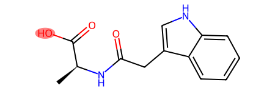
    


## Reactions

Chemical reactions can be represented via SMARTS, an extension of SMILES. Here, I source known 
reactions and provide some reactions that give various non-standard sulfur and nitrogen oxidation states.


### Load RetroRules SMARTS Reaction Database

Enzyme function is categorized by an Enzyme Commission (EC) number. See the 
[wikipedia](https://en.wikipedia.org/wiki/Enzyme_Commission_number) article for more information.
I pulled SMARTS representations of some of those reactions from the 
[RetroRules database](https://retrorules.org/).


```python
rr_path = pathlib.Path(r"retrorules_rr02_flat_all.tsv")
rxn_df = pd.read_csv(rr_path, sep='\t')
# Remove retrosynthetic rules for now.
print(f'{rxn_df.shape=}')
rxn_df = rxn_df[~(rxn_df['Rule_usage'] == 'retro')]
display(Markdown("#### Forward RetroRules"))
print(f'{rxn_df.shape=}')
display(rxn_df.head(2))
```

    rxn_df.shape=(351704, 18)


#### Forward RetroRules


    rxn_df.shape=(235312, 18)


    /home/tyler/miniconda3/envs/pymc_env/lib/python3.11/site-packages/rdkit/Chem/PandasPatcher.py:132: FutureWarning: DataFrame.applymap has been deprecated. Use DataFrame.map instead.
      for col in df_subset.columns[df_subset.applymap(MolFormatter.is_mol).any()]


<div>
<style scoped>
    .dataframe tbody tr th:only-of-type {
        vertical-align: middle;
    }

    .dataframe tbody tr th {
        vertical-align: top;
    }

    .dataframe thead th {
        text-align: right;
    }
</style>
<table border="1" class="dataframe">
  <thead>
    <tr style="text-align: right;">
      <th></th>
      <th># Rule_ID</th>
      <th>Legacy_ID</th>
      <th>Reaction_ID</th>
      <th>Diameter</th>
      <th>Rule_order</th>
      <th>Rule_SMARTS</th>
      <th>Substrate_ID</th>
      <th>Substrate_SMILES</th>
      <th>Product_IDs</th>
      <th>Product_SMILES</th>
      <th>Rule_SMILES</th>
      <th>Rule_SMARTS_lite</th>
      <th>Score</th>
      <th>Score_normalized</th>
      <th>Reaction_EC_number</th>
      <th>Reaction_direction</th>
      <th>Rule_relative_direction</th>
      <th>Rule_usage</th>
    </tr>
  </thead>
  <tbody>
    <tr>
      <th>0</th>
      <td>RR-02-fbdda75e23f518b6-02-F</td>
      <td>MNXR94682_MNXM821</td>
      <td>MNXR94682</td>
      <td>2</td>
      <td>1</td>
      <td>([#6&amp;v4:1](=[#8&amp;v2:2])(-[#6&amp;v4:3](-[#6&amp;v4:4])(...</td>
      <td>MNXM821</td>
      <td>[H][C](=[O])[C]([H])([H])[C]([H])([H])[H]</td>
      <td>MNXM90191</td>
      <td>[H][O][C]([H])([H])[C]([H])([O][H])[C]([H])([H...</td>
      <td>[C](=[O])(-[C](-[C])(-[H])-[H])-[H]&gt;&gt;[C](-[O]-...</td>
      <td>([#6&amp;v4](=[#8&amp;v2])(-[#6&amp;v4](-[#6&amp;v4])(-[#1&amp;v1]...</td>
      <td>4.295611</td>
      <td>0.104697</td>
      <td>NaN</td>
      <td>0</td>
      <td>1</td>
      <td>both</td>
    </tr>
    <tr>
      <th>1</th>
      <td>RR-02-0250d458c4991a7d-02-F</td>
      <td>MNXR94682_MNXM90191</td>
      <td>MNXR94682</td>
      <td>2</td>
      <td>1</td>
      <td>([#6&amp;v4:1](-[#8&amp;v2:2]-[#1&amp;v1:3])(-[#6&amp;v4:4](-[...</td>
      <td>MNXM90191</td>
      <td>[H][O][C]([H])([H])[C]([H])([O][H])[C]([H])([H...</td>
      <td>MNXM2.MNXM821</td>
      <td>[H][O][H].[H][C](=[O])[C]([H])([H])[C]([H])([H...</td>
      <td>[C](-[O]-[H])(-[C](-[C])(-[O]-[H])-[H])(-[H])-...</td>
      <td>([#6&amp;v4](-[#8&amp;v2]-[#1&amp;v1])(-[#6&amp;v4](-[#6&amp;v4])(...</td>
      <td>4.295611</td>
      <td>0.104697</td>
      <td>NaN</td>
      <td>0</td>
      <td>-1</td>
      <td>both</td>
    </tr>
  </tbody>
</table>
</div>


### Filtering Based on Species

Suppose you want to filter reactions based on species. Here, I load some *Saccharomyces cerevisiae* data 
from [UniProt](https://www.uniprot.org/), a database of "...protein sequence and functional information".
I filter the reactions from the RetroRules database using the EC codes found here in the species data
from UniProt.


```python
sc_df = pd.read_csv("uniprot-ec +organism Saccharomyces+cerevisiae .tab", sep='\t')
sc_rxns = np.intersect1d(rxn_df['Reaction_EC_number'].astype(str).unique(), sc_df['EC number'].astype(str).unique())
sc_rxn_df = rxn_df.loc[rxn_df['Reaction_EC_number'].isin(sc_rxns)].reset_index(drop=True)

display(Markdown("#### Saccharomyces Cerevisiae Reactions"))
print(f'{sc_rxn_df.shape=}')
# View a reaction.
rxn = Chem.ReactionFromSmarts(sc_rxn_df.loc[0, 'Rule_SMARTS'])
Chem.SanitizeRxn(rxn)
display(rxn)
display(sc_rxn_df.head(1).T)
```


#### Saccharomyces Cerevisiae Reactions


    sc_rxn_df.shape=(21672, 18)


    
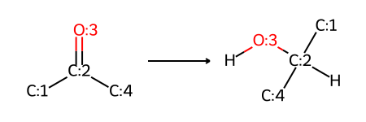
    


    /home/tyler/miniconda3/envs/pymc_env/lib/python3.11/site-packages/rdkit/Chem/PandasPatcher.py:132: FutureWarning: DataFrame.applymap has been deprecated. Use DataFrame.map instead.
      for col in df_subset.columns[df_subset.applymap(MolFormatter.is_mol).any()]


<div>
<style scoped>
    .dataframe tbody tr th:only-of-type {
        vertical-align: middle;
    }

    .dataframe tbody tr th {
        vertical-align: top;
    }

    .dataframe thead th {
        text-align: right;
    }
</style>
<table border="1" class="dataframe">
  <thead>
    <tr style="text-align: right;">
      <th></th>
      <th>0</th>
    </tr>
  </thead>
  <tbody>
    <tr>
      <th># Rule_ID</th>
      <td>RR-02-c3681aa8011dc014-02-F</td>
    </tr>
    <tr>
      <th>Legacy_ID</th>
      <td>MNXR94689_MNXM101404</td>
    </tr>
    <tr>
      <th>Reaction_ID</th>
      <td>MNXR94689</td>
    </tr>
    <tr>
      <th>Diameter</th>
      <td>2</td>
    </tr>
    <tr>
      <th>Rule_order</th>
      <td>1</td>
    </tr>
    <tr>
      <th>Rule_SMARTS</th>
      <td>([#6&amp;v4:1]-[#6&amp;v4:2](=[#8&amp;v2:3])-[#6&amp;v4:4])&gt;&gt;(...</td>
    </tr>
    <tr>
      <th>Substrate_ID</th>
      <td>MNXM101404</td>
    </tr>
    <tr>
      <th>Substrate_SMILES</th>
      <td>[H][O][C](=[O])[C]([H])([H])[C]([H])([H])[C]([...</td>
    </tr>
    <tr>
      <th>Product_IDs</th>
      <td>MNXM9689</td>
    </tr>
    <tr>
      <th>Product_SMILES</th>
      <td>[H][O][C](=[O])[C]([H])([H])[C]([H])([H])[C]([...</td>
    </tr>
    <tr>
      <th>Rule_SMILES</th>
      <td>[C]-[C](=[O])-[C]&gt;&gt;[C]-[C](-[O]-[H])(-[C])-[H]</td>
    </tr>
    <tr>
      <th>Rule_SMARTS_lite</th>
      <td>([#6&amp;v4]-[#6&amp;v4](=[#8&amp;v2])-[#6&amp;v4])&gt;&gt;([#6&amp;v4]-...</td>
    </tr>
    <tr>
      <th>Score</th>
      <td>3.068557</td>
    </tr>
    <tr>
      <th>Score_normalized</th>
      <td>0.140673</td>
    </tr>
    <tr>
      <th>Reaction_EC_number</th>
      <td>1.1.1.-</td>
    </tr>
    <tr>
      <th>Reaction_direction</th>
      <td>0</td>
    </tr>
    <tr>
      <th>Rule_relative_direction</th>
      <td>1</td>
    </tr>
    <tr>
      <th>Rule_usage</th>
      <td>both</td>
    </tr>
  </tbody>
</table>
</div>


## Adding Custom SMARTS Reactions

I co-authored a paper: 
[Hydrogen sulfide (H2S) releasing agents: chemistry and biological applications](https://pubs.rsc.org/en/content/articlelanding/2014/cc/c4cc00968a).
The takeaway for this notebook is that many different oxidation states of sulfur are of potential
interest in biology. In my experience, including all possible oxidation states is not a usual 
feature of compound databases. The combinatorics explosion of possible compounds above even 100 amu 
is staggering, so any thoughts of a holistic database are probably unfeasible. Instead, we can alter
the oxidation states of known compounds and check for those mass signals within our observed data.


You can view [Chem Libre Texts](https://chem.libretexts.org/Bookshelves/Organic_Chemistry/Book%3A_Virtual_Textbook_of_OChem_(Reusch)_UNDER_CONSTRUCTION/14%3A_Thiols_and_Sulfides),
which has a figure with the oxidation states of sulfur.


```python
# I write these reactions with extra newlines to make them easier to read and type.
# The newline characters must be stripped before use.
thiol_oxidations = dict(
    disulfide_sym="""
[C:1]-[S;D1:2]
>>
[C:1]-[S:2]-[S:2]-[C:1]
""",
    trisulfide_sym="""
[C:1]-[S;D1:2]
>>
[C:1]-[S:2]-[S]-[S:2]-[C:1]
""",
    sulfenic="""
[C:1]-[S;D1:2]
>>
[C:1]-[S:2](-O)
""",
    sulfinic="""
[C:1]-[S;D1:2]
>>
[C:1]-[S:2](=O)(-O)
""",
    sulfonic="""
[C:1]-[S;D1:2]
>>
[C:1]-[S](=O)(=O)-O
""",
    sulfonic_thiol="""
[C:1]-[S;D1:2]
>>
[C:1]-[S](=O)(=O)-S
""",
    sulfonic_thioester_sym="""
[C:1]-[S;D1:2]
>>
[C:1]-[S](=O)(=O)-S-[C:1]
""",
)

# Remove newline characters.
thiol_oxidations = {k: v.replace('\n', '') for k, v in thiol_oxidations.items()}

thiol_df = pd.DataFrame.from_dict(thiol_oxidations, orient='index', columns=['Rule_SMARTS'])
for k, v in thiol_oxidations.items():
    display(Markdown(f"#### {k}"))
    rxn = Chem.ReactionFromSmarts(v)
    Chem.SanitizeRxn(rxn)
    display(rxn)
    
# thiol_df['EC number'] = 'custom thiol rxns'
thiol_df['Rule ID'] = thiol_df.index.values
thiol_df = thiol_df.loc[:, ['Rule ID', 'Rule_SMARTS']]

thiol_df
```


#### disulfide_sym


    
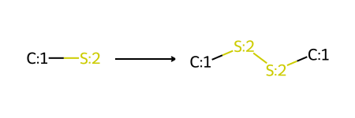
    


#### trisulfide_sym


    
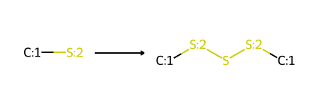
    


#### sulfenic


    
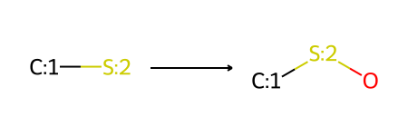
    


#### sulfinic


    
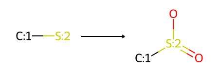
    


#### sulfonic


    
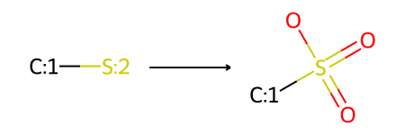
    


#### sulfonic_thiol


    
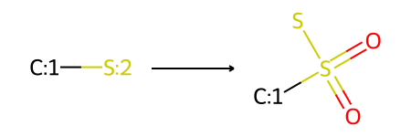
    


#### sulfonic_thioester_sym


    
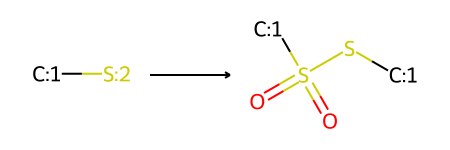
    


    /home/tyler/miniconda3/envs/pymc_env/lib/python3.11/site-packages/rdkit/Chem/PandasPatcher.py:132: FutureWarning: DataFrame.applymap has been deprecated. Use DataFrame.map instead.
      for col in df_subset.columns[df_subset.applymap(MolFormatter.is_mol).any()]


<div>
<style scoped>
    .dataframe tbody tr th:only-of-type {
        vertical-align: middle;
    }

    .dataframe tbody tr th {
        vertical-align: top;
    }

    .dataframe thead th {
        text-align: right;
    }
</style>
<table border="1" class="dataframe">
  <thead>
    <tr style="text-align: right;">
      <th></th>
      <th>Rule ID</th>
      <th>Rule_SMARTS</th>
    </tr>
  </thead>
  <tbody>
    <tr>
      <th>disulfide_sym</th>
      <td>disulfide_sym</td>
      <td>[C:1]-[S;D1:2]&gt;&gt;[C:1]-[S:2]-[S:2]-[C:1]</td>
    </tr>
    <tr>
      <th>trisulfide_sym</th>
      <td>trisulfide_sym</td>
      <td>[C:1]-[S;D1:2]&gt;&gt;[C:1]-[S:2]-[S]-[S:2]-[C:1]</td>
    </tr>
    <tr>
      <th>sulfenic</th>
      <td>sulfenic</td>
      <td>[C:1]-[S;D1:2]&gt;&gt;[C:1]-[S:2](-O)</td>
    </tr>
    <tr>
      <th>sulfinic</th>
      <td>sulfinic</td>
      <td>[C:1]-[S;D1:2]&gt;&gt;[C:1]-[S:2](=O)(-O)</td>
    </tr>
    <tr>
      <th>sulfonic</th>
      <td>sulfonic</td>
      <td>[C:1]-[S;D1:2]&gt;&gt;[C:1]-[S](=O)(=O)-O</td>
    </tr>
    <tr>
      <th>sulfonic_thiol</th>
      <td>sulfonic_thiol</td>
      <td>[C:1]-[S;D1:2]&gt;&gt;[C:1]-[S](=O)(=O)-S</td>
    </tr>
    <tr>
      <th>sulfonic_thioester_sym</th>
      <td>sulfonic_thioester_sym</td>
      <td>[C:1]-[S;D1:2]&gt;&gt;[C:1]-[S](=O)(=O)-S-[C:1]</td>
    </tr>
  </tbody>
</table>
</div>


## Running Reactions

With SMARTS reactions and SMILES precursors, I can now run some reactions. 

Most commonly, we want to investigate some number of possible adducts. Depending
on the number of different adducts to consider, I can either:
+ Explicitly write adduct transformation reactions.
+ Create a database of starting materials, then fingerprint them based on my reactions so
  that I can load only valid compounds for a given reaction.

For now, I only consider reactions that transform a single starting compound. 


```python
def run_rxn(rxn_smarts, cmpds):
    rxn = Chem.ReactionFromSmarts(rxn_smarts)
    Chem.SanitizeRxn(rxn)
    library = Chem.rdChemReactions.EnumerateLibrary(rxn, [cmpds, ])
    output = []
    for products in library:
        for results_for_product_template in products:
            for mol in results_for_product_template:
                try:
                    Chem.SanitizeMol(mol)
                    rs = Chem.GetMolFrags(mol, asMols=True)
                    output.extend(rs)
                except (Chem.AtomValenceException, Chem.KekulizeException):
                    continue
    return output
```

Here I test the function by creating cysteine disulfide.


```python
cystiene = Chem.MolFromSmiles("C(C(C(=O)O)N)S")
display(cystiene)
display(thiol_df.loc['disulfide_sym', 'Rule_SMARTS'])
cystiene_disulfide = run_rxn(thiol_df.loc['disulfide_sym', 'Rule_SMARTS'], [cystiene])[0]
cystiene_disulfide
```


    

    


    '[C:1]-[S;D1:2]>>[C:1]-[S:2]-[S:2]-[C:1]'


    
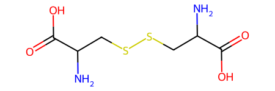
    


### Checking M+ Adducts vs Observed m/z Signals

To demonstrate clearly how adducts are examined I have made this diagnostic function.
I calculate using the [`np.isclose`]() function with the desired tolerance. I return
the information of the matches, and discard the rest.
Now here I have the same function, but this time written so that I do not create an intermediate
pandas dataframe.

The size of this intermediate matrix depends on the number of unique m/z values used.
Here I use around 172k unique m/z values.


```python
instrument_ppm = 5e-6  # 5 pppm
mz_tol = 0.0005


def check_cmpd_adducts_vs_obs(cmpd, obs_mz_vals, attrs=None, m_plus_df=m_plus_df, mz_tol=mz_tol):
    """Only returns data if the given compound has a potential match in an m/z dataset."""
    try:
        neutral_mol_wt = Chem.CalcExactMolWt(cmpd)
    except:
        print(f"Failed to make compound from {cmpd}")
        return None
    
    charged_mol_wt = (neutral_mol_wt + m_plus_df['Mass'].values) * m_plus_df['Mult'].values
    close_mz = np.isclose(charged_mol_wt[:, np.newaxis], obs_mz_vals, rtol=0, atol=mz_tol)
    matching_idx = np.argwhere(close_mz)
    
    output = []
    if attrs is None:
        attrs = dict()

    if matching_idx.size > 0:
        for add_idx, obs_idx  in matching_idx:
            m_silico_mz = charged_mol_wt[add_idx]
            output.append({
                "canonical_smiles": Chem.MolToSmiles(cmpd),
                "Mol_wt": Chem.CalcExactMolWt(cmpd),
                "Adduct": m_plus_df['Ion name'].iloc[add_idx],
                "Silico M+Adduct m/z": m_silico_mz,
                "Observed m/z match": obs_mz_vals[obs_idx],
                "Δ m/z": abs(obs_mz_vals[obs_idx] - m_silico_mz),
                "Δ ppm": abs(obs_mz_vals[obs_idx] - m_silico_mz) / obs_mz_vals[obs_idx] / 1e-6,
                **attrs
            })
        return output
```

Here I demonstrate the (truncated) output of the above function. The critical information
output at this stage is the adduct matched and its associated ppm difference between the 
silico calculation and the observed m/z value.


```python
test_results = check_cmpd_adducts_vs_obs(
    sm_df['ROMol'].values[0],
    unique_mzs,
    {"source": "demo_source"},
)
adduct_test_df = pd.DataFrame(test_results).iloc[:6]
PandasTools.AddMoleculeColumnToFrame(adduct_test_df, smilesCol='canonical_smiles')
ppm_vals = [f'delta ppm: {ppmval:.3f}' for ppmval in adduct_test_df['Δ ppm'].values]
adduct_ions = [f'Adduct: {a}' for a in adduct_test_df['Adduct'].values]
legends = ['\n'.join([a, ppm]) for a, ppm in zip(adduct_ions, ppm_vals)]
Chem.Draw.MolsToGridImage(adduct_test_df['ROMol'].values, legends=legends)
```


    
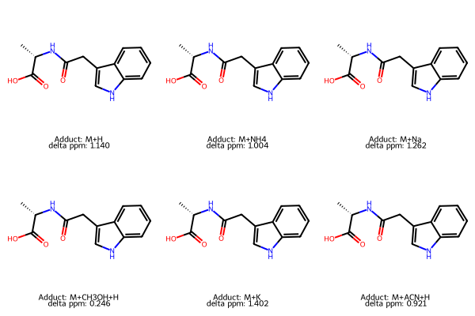
    


Now, I write a function to run reactions of interest, which will pass its results to
`check_cmpd_adducts_vs_obs`, which in turn will only return compounds that have a 
potential match within a given set of m/z values.


```python
def run_all_reactions(reaction_df, reagent_df, obs_mz_vals, mz_tol, chunk_size=500):
    """
    Runs all provided reactions in chunks. Saves compounds or adducts thereof within 
    the given m/z tolerance to the output file.
    
    Providing as many compounds as you can manage per chunk is faster.
    The source of the created compound will be the corresponding reaction.
    """
    n_chunks = int(np.ceil(reagent_df.index.values.size / chunk_size))
    for rxn_idx in tqdm(reaction_df.index.values):
        curr_rxn = reaction_df.loc[rxn_idx, 'Rule_SMARTS']
        for rgt_idx in np.array_split(reagent_df.index.values, n_chunks):
            curr_reagent = reagent_df.loc[rgt_idx, 'ROMol'].tolist()
            gen_cmpds = run_rxn(curr_rxn, curr_reagent)
            if gen_cmpds:
                for gen_cmpd in gen_cmpds:
                    # Remove stereochemistry so that stereoisomers are stored only once.
                    Chem.RemoveStereochemistry(gen_cmpd)
                    obs_gen = check_cmpd_adducts_vs_obs(gen_cmpd, obs_mz_vals, {'rxn': curr_rxn})
                    if obs_gen:
                        for ob in obs_gen:
                            ob["SMARTS_reaction"] = curr_rxn
                            yield ob
```

Again, I test the function and view the output.


```python
rxn_test = list(run_all_reactions(
    reaction_df=sc_rxn_df[:2],
    reagent_df=sm_df,
    obs_mz_vals=unique_mzs,
    mz_tol=mz_tol
))
rxn_test[:1]
```

    100%|██████████████████████████████████████████████████████████████████████████████████████████████████████████████████████████████████| 2/2 [00:43<00:00, 21.70s/it]


    [{'canonical_smiles': '[H]OC1([H])c2c(O)cc(O)cc2OC(c2ccc(O)c(O)c2)C1O',
      'Mol_wt': 306.07395278799993,
      'Adduct': 'M+H+K ',
      'Silico M+Adduct m/z': 163.02958489399995,
      'Observed m/z match': 163.03,
      'Δ m/z': 0.0004151060000481266,
      'Δ ppm': 2.5461939523285686,
      'rxn': '([#6&v4:1]-[#6&v4:2](=[#8&v2:3])-[#6&v4:4])>>([#6&v4:1]-[#6&v4:2](-[#8&v2:3]-[#1&v1])(-[#6&v4:4])-[#1&v1])',
      'SMARTS_reaction': '([#6&v4:1]-[#6&v4:2](=[#8&v2:3])-[#6&v4:4])>>([#6&v4:1]-[#6&v4:2](-[#8&v2:3]-[#1&v1])(-[#6&v4:4])-[#1&v1])'}]


```python
rxn_test_df = pd.DataFrame(rxn_test)
print(f"{rxn_test_df.shape=}")

rxn_test_adducts = rxn_test_df.groupby('canonical_smiles')[['Adduct']].nunique().reset_index()
PandasTools.AddMoleculeColumnToFrame(rxn_test_adducts, smilesCol='canonical_smiles')
print(f"{rxn_test_adducts.shape=}")

legends = [f"n adducts found: {n}" for n in rxn_test_adducts['Adduct'].values[:6]]
Chem.Draw.MolsToGridImage(rxn_test_adducts['ROMol'].values[:6], legends=legends)
```

    rxn_test_df.shape=(15486, 9)
    rxn_test_adducts.shape=(215, 3)


    
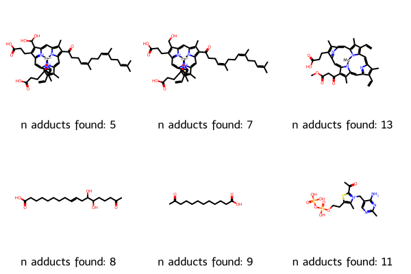
    


Now, I provide a function that dumps the output of `run_all_reactions` as a comma-delimited text file,
that should load into a pandas data frame without any issue.


```python
def run_and_save_results(reaction_df, output_filepath, reagent_df=sm_df):
    result_generator = run_all_reactions(
        reaction_df=reaction_df,
        reagent_df=reagent_df,
        obs_mz_vals=combined_unique_mzs,
        mz_tol=mz_tol
    )

    with open(output_filepath, 'w') as file:
        for result in result_generator:
            file.write(", ".join([str(v) for v in result.values()]) + "\n")

    print('Complete')
    print(f'{silico_df.shape=}')
    print(f'{output_filepath=}') 
```

With that, I can produce many silico compounds and keep only those with a potential match within the data.
The idea is that one can make more informed decisions about where to spend more analytical resources.

## Plot with Compound Images

While the data itself is critical, so to is sharing it in a usable format.
To that end, here is the code I have compiled to show compound structures and
associated information upon hovering over a point in a scatter plot. The
scatter plot shows the peak centroid location on m/z and retention
time coordinates.

I striped the retention times in this notebook to ensure data privacy for
collaborators, so here, I will generate some random retention times to demonstrate
this code. I must create images of the compounds and tooltips for each point to do this. I arbitrarily filter the results here to make the final plot easier to view.


```python
# Add the random retention times
rng = np.random.default_rng()
mz_match_unique = rxn_test_df['Observed m/z match'].unique()
random_rt = rng.random(size=mz_match_unique.shape[0])
random_rt_map = {mz: rt for mz, rt in zip(mz_match_unique, random_rt)}
plot_df = rxn_test_df.groupby('Observed m/z match').first().reset_index()
plot_df['random_rt'] = plot_df['Observed m/z match'].map(random_rt_map)
smiles_mapper = {smiles: Chem.MolFromSmiles(smiles)
                 for smiles in plot_df["canonical_smiles"].unique()
                 if isinstance(smiles, str)}
plot_df['ROMol'] = plot_df["canonical_smiles"].apply(
    lambda v: smiles_mapper[v] if isinstance(v, str) else None)
```

### Creating Images from Compounds


```python
# Code for storing compound images locally.
# Adapted from an answer on stack-exchange.
from io import BytesIO
from PIL import Image
from skimage import img_as_ubyte
import base64
from bokeh.models import HoverTool
from IPython.display import HTML

def to_png(im):
    out = BytesIO()
    im.save(out, format='png')
    return out.getvalue()


def make_image_html(cmpd):
    image = Chem.Draw.MolToImage(cmpd)
    png = to_png(image)
    url = 'data:image/png;base64,' + base64.b64encode(png).decode('utf-8')
    return f"""
<div>
    </img>
</div>
"""

HTML(make_image_html(cystiene))
```

<br>


<div>
    <img src="data:image/png;base64,iVBORw0KGgoAAAANSUhEUgAAASwAAAEsCAIAAAD2HxkiAAAclElEQVR4nO3deVxU570/8M+wM2wDKILighsuEXcNsZIb96oYr4bQ5KeJiX0Zk96SpGlr0utLkrS3NYnXuqQvb7RpxBhrkagX9KpQEyMuKLhPoiKb4IKIMCDLDMzM+f0xU0JwWDQwz8w5n/fLP8w8D2e+MX5yzvM85zxHJUkSiEgcF9EFECkdQ0gkGENIJBhDSCQYQ0gkGENIJBhDSCQYQ0gkGENIJBhDSCQYQ0gkGENIJBhDSCQYQ0gkGENIJBhDSCQYQ0gkGENIJBhDSCQYQ0gkGENIJBhDSCQYQ0gkGENIJBhDSCQYQ0gkGENIJBhDSCQYQ0gkGENIJBhDSCQYQ0gkGENIJBhDSCQYQ0gkGENIJBhDSCQYQ0gkGENIJBhDSCQYQ0gkGENIJBhDSCQYQ0gkGENIJBhDSCQYQ0gkGENIJBhDSCQYQ0gkGENIJBhDSCQYQ0gkGENIJBhDSCQYQ0gkGENIJBhDSCQYQ0gkGENIJBhDSCSYm+gCulJ5OUpLUVODgACEh8PPT3RBRDbIMYS1tdiwATt2QKv9/kM3N0yYgGXLsGgRXF3FFUfUkkqSJNE1dCqtFrNno6TE+o8hIfD1RXk5qqutn0RH43//F927iyqQqAV5jQkLCxETg5ISeHrid79DURHu3EF+PqqqcO4c4uMB4ORJTJmC+nrRtRJZyetMGBODzEx4eGD/fkybZqPD73+PVasA4M03sXatnasjsklGITx2DJMnA8DKlfj97233kSRMmYIjR6BWo6QEQUH2LJDIJhldjm7fDgBubvjFL1rto1LhrbcAoK4Ou3fbqTCiNskohMePA8DIkQgNbavb9OlwdweAEyfsURVRe2QUwrw8ABg+vJ1unp4YOBAAcnO7vCSiDpBLCOvrodcDQGBg+50tQ8HKyq4tiahj5BJCo9H6m44sxLu5AUBjYxfWQ9Rhcgmhr681Wvfvt9/ZsnDfkXMmUdeTSwhVKoSFAUB+fjs9JcnaJzy8y6si6gC5hBDAhAkAcPYsGhra6vbtt9Yz4cSJ9qiKqD0yCuHs2QCg02Hfvra6JSVZfzNnTpeXRNQBMrpjpq4Offrg3j0MGoSzZ+Hra6PPlSsYPRp6PaZMweHDdi+RyAYZnQnVaqxfDwDXrmHWrO8fpGhy+jSmT4deDy8vbNxo/wKJbJLRmdDinXewejUAqNWYOxcTJsDPD+XlOHIEhw/DbIanJz7/HHFxogslspJdCAF88QXeecfGmRDAuHFYvx5PPGH3mohaJccQAtDr8c03+Oor3LqF+/cRGIiICMyYgYkToVKJLo7oB2QawnYVFCA3F7Nmia6DSJkh1OkQHAx3d1RVwdNTdDWkdDKaHX1QSQkqKmx8rtFg6FAYDDh3zu41EbUk3xAmJKBPH+zYYbs1OhrgI4XkEOQbwmHDAODkSdutlhC21kpkR/INoWUdorWYWVp5JiQHIN+JGbMZQUGoqsKtW9YHLJqTJISEoLwc16+jTx8R9RFZyfdM6OKC8eMBICvLRqtKZX3qglekJJp8Q4j2rkg5LCTHIOsQtj0FymEhOQb5jgnR3qJ8bS00GqhU0OmgVouojwiQ+ZlQo8GQITAYcP68jVYfHzz2GBobceaMvQsjakbWIUR7Az8OC8kBMIQMIQkm9xBaZl+OHWurlXMzJJSsJ2YASBK6dUNFBYqL0bu3jQ5hYSgtRV4eBgywe3FEgPzPhCqVdWvD1q45224l6npyDyE4LCRHp4AQtj3w4zNNJJrcx4SAdY8ZFxfbi/L19dBoYDJBp7O9VSlRF1PAmdDPz7oof/asjVZvb4wcCZMJp0/bvTIiQBEhBIeF5NAYQoaQBFPAmBBAXh4GDUJICO7csdFaXIy+fREYiHv3uCsp2Z8yzoQDB6JHD5SVoaDARmufPggPR2Ulrl61e2VECgkh2luUf/zxtlqJupJiQshhITkqhYWwzSV7Mx8sJBEUE8IJE+DujosXUVPzYKM0ZsxLUVF+Wq1Op7N7ZXKzd+/eiIgIb2/v+Pj4EydOmM1m0RU5OsWEsGlRPjv7wUaVp2eur29dQ8OpU6fsX5qcbN68ecGCBUVFRXq9Pjk5edKkSb169XrllVcOHDhgMBhEV+egFBNCIHPevKXDh/93KzGLjo4GcJLDwh9h//79y5cvlyQpLCxs06ZNiYmJkZGRpaWlmzdvnj17dlBQUGxs7LZt23i50ZKkGDt27AAwd+5cm60pKSkAZsyYYeeqZGPHjh3u7u4AIiMj9Xp90+darXb16tWTJk1S/WsN1tXVddKkSevWrSspKRFYsONQUAiLiooABAcHm83mB1tv3rwJwN/f32g02r82Z/eXv/zFxcUFQEJCgs0/XkmSrl+//sknn8ydO9fDw6PpHDBs2LDExMScnBw7F+xQFBRCSZJ69eoF4MqVKzZb+/btC+DSpUt2rsrZrV69GoBKpfrggw860r+ioiI5OXnx4sV+fn5NaYyIiEhISMjIyGhsbOzqgh2NskK4cOFCAJ999pnN1ueeew7AJ598Yt+inJjZbH7zzTctV5hbtmx52B+vr6/PyMhISEgIa/aykG7dui1evDg1NbX5Na28KSuEa9asAbBs2TKbrRs2bACwZMkSO1flpBobG5csWQLA09MzJSXlxxzKZDLl5OQkJiYOGTKkKY1qtXru3LlJSUmVlZWdVLKDUlYIjx8/DmDEiBE2W7Ozsy3zCnauyhnV1tb+9Kc/BeDr65uRkdGJR7548eL7778/ZsyYpjR6eHhMnz69oOCvDQ03OvGLHIcynqL4F4PBEBAQ0NjYWFFRERAQ0KK1sbFRo9HU19eXlZV169ZNSIVOobKyMjY29vjx4z169Dhw4MDo0aO74luKi4sPHjyYlpaWnp7er5//3/9eKUkmL69hgYFxGk2sWj22K75UCGWFEEB0dHRWVtahQ4dmzJjxYOuTTz559OjRffv2zZkzx/61OYXS0tJZs2ZduHChX79+hw4dGjx4cFd/Y0VFxdWr/+zRI7mq6qDZXGv50MtrsEYzPyDgaV/fx519udu5q38ETzzxBFpflG+7lQoLCydPnnzhwoVhw4ZlZmbaIYEAgoKCoqOf7d8/ZeTI8kGDMkJCEtzdw/T63NLSD69enXThQo+ioheqqtIk6UfdkWMw5JWWflhY+P+uXftpQcHPbtz4dWVlstn8/U2OFRU7rlyZeOXKRLO5rrWDlJdvsfR5qK92e/SqnVPbd8ZYWk9w8zVbtFrtzJkzb926NWHChP3799v/it3Fxcvff5q//7Tevf9cV3dOp0urrNyp11+9d+/ze/c+d3FR+/lNCQyM02jmubpqOn5YSTLduPFWWdlGoOVtri4uXoMGHfL1jQHQ2Hi7tvY0AEkytnaohoYblj4PRXEhtJzrTp06ZTabLevLLVpVKtXp06eNRqObm+L+cNpw9OjRefPmVVVVTZ06dc+ePc2X+ERwUavHqtVje/Z8t77+26qqfVVVaTU1J6qq9lVV7VOpXH18Hg8MjNNoFnp4hLd7rJs33ykrWw/Aza17UNDznp79JcloMBRUV6c3NBR6e0d19b+M4v6e9ezZs0+fPsXFxZcvXx4+fHiL1m7dug0YMCAvL+/SpUtdNN/gjNLS0uLj4+vr65977rmkpCTL7WkOwtt7uLf38NDQFQ0NxdXVB3W6tOrq9Jqa4zU1x0tK3mh3IqexsbSsbB0AH5+Jgwf/08XlB9teGgz5D3VSfTSKGxOivWtO3sndwvbt2xcuXFhfX//aa69t377doRLYnIdHn27dlg0cmDZyZGn//snBwYtdXf30+u9u337v8uVxWm3/kpLXq6v/2eJi8v79I5LUCCAsbGWLBALw9LTHG0qUG8K2h4UMocWGDRtefPHFxsbGFStWNN0g6uBcXQMDA+P69dsWFVXWNJFjMBSWlW24dm36xYthzSdyTKZKy0+5uQWLKtgJ/kw7XUcmSDk3I0nSu++++/rrr0uStHbtWssNos7FMpHTu/f6qKgbQ4fmhIUlenlFGo3l9+59npc3z2AoAuDuHmrpXFGRLKpOxY0JAYwaNUqtVl+9erW8vPzBKb7HHnvM39+/oKCgtLQ0NDRUSIXCmUym1157bfPmzW5ublu2bLHcnubMmk/kXNTp9tbXX/LyigTg6/uki4uP2VxbVrZOkgyhoSs8PPrauTglhtDd3X3s2LGZmZmnT5+ePXt2i1ZXV9fx48cfPnw4Kytr/vz5IgoUrKGhYdGiRbt27VKr1SkpKZbb02TD2zuq+YSnm1tQePhHxcWvAbh7d9Pdu5/4+U0ODn4pMDDOxeWBN5cAAC5d6tPawc1m/SOUpMTLUXBY2Lra2trY2Nhdu3YFBgamp6fLLIE2de/+6sCBqT4+EwAA5vv3vykqWnLxYs+SkjebL9Y3MZmqWvv1aDcMKPFMCE6QtqKiomLOnDlZWVmhoaEHDx4cOXKk6IrsJCAgNiAgVq+/cu/e55WVfzcYCk2mqrKydbW1xwcP/sbFxbt556FDz7q4+Ng8zt27G8vKPn7Yb1doCJuW7G0uyj/xxBMuLi7Z2dkNDQ3NHwOXt1u3bs2cOVOr1UZERKSnpw8cOFB0Rfbm5TWkV6//6tXrDzU1x0pKXq+rO1dbm33nzn+Hha1s3s3Tc4Crq7/NI7i6Bj3C9yr0cjQkJGTAgAG1tbVarfbBVo1GY9ko5fz583YvTYwrV648/vjjWq32scceO3bsmAIT2IzK13fy4MFHLBOnFRVfdPX3KTSEsHXNmZub+91337XWKmM5OTkxMTElJSUxMTHHjh3r2bOn6IrEc3X19/efCaCh4XpXfxdDeBKAJEnjx4+PjIwcPny4n5/fzJkz+/XrB2WE8Ouvv546derdu3djY2MPHjz44GOWimVZx1epunzIptwQNi3KNzY2vvDCCzk5OZbPa2pq0tPTV61aBeDAgQNnzpyR8SOXe/funT17dnV19aJFi7788ktvb+/2f0ZeJMkgSQ0Pft7QUHz//jcA7HADt3JDOGLECF9f3/z8/Pnz52/fvt3X13fnzp1lZWUrVqyYNm1aSEgIgOrq6nHjxvXt2/eVV15JS0traLDxX8t5bd26NS4uTq/XJyQkONpt2XZTWbnr0qW+JSVv1tRkmkw6ACbTfZ0u9dq1mSZTFYDu3Zd3eRHidtYQLyYmxvKHEBQUdPLkyeZNRqMxMzMzISGhd+/eTX9WgYGBcXFxSUlJVVVVomruLKtXr1apVCqVKjExUXQtIuXnL8zJQdOvs2e9mv/j9euvSZJ1G9XS0jWWD43GVv/r37y5ytLnoWpQbghv375tCVjPnj1b24nUQqvVJiYmjh37/bMwXl5e06ZNW7du3a1bt+xWcGcxm82//vWvAbi6unJ/R5OprqIiOS9vwblzmqbsnTnjcfXqUzpdavOeOl1qXt6CvLwFJlNda0erqNhp6fNQNSg0hAUFBYMGDQIwdOjQ4uLiDv5UYWHhunXrpk2b1rS06OLiMnbs2MTExMuXL3dpwZ3FaDS+/PLLADw8PJKTk0WX41gaGm7r9bkGQ5HZbLDn9yoxhFqt1rIV9/jx4+/evfsIRygvL09KSoqLi/Px+f7Oif79+yckJGRmZra2D7xwer1+wYIFAHx8fA4dOiS6HLJSXAizsrKCg4MBTJkypbq6+kcera6uLjU1ddmyZZaJHIvevXsvW7YsNTXVYLDr/1DbVllZOXnyZJsDYBJLWSHct2+fWq0GMH/+/Pr6+k48soNP5JSWlo4aNcoyAObLNhyNgkLYtDXD8uXLTSZT132Ro03kFBYWWgbAQ4YM6fgAmOxGKSHcuHGjZWuGFStW2O1LHWEip2kAPG7cuLKyMvt8KT0URYSw6d1da9asEVKAqImcU6dOWQbATz31lPBLYmqNzENoNBqXL19uWRP79NNPRZdj14mcjIwMX1/frhgAU+eScwgNBkN8fDwAT0/P3bt3iy7nB7p6IueLL76wDICXLFmiwNduOhfZhrCmpmbWrFkANBpNZmam6HLa0ukTOR9//HHTANhhFy2piTxDWFFRYXlIIjQ09Ny5c6LL6aiCgoIfP5HTNAD+6KOPurRa6iwyDOGtW7dGjBgBICIiIjc3V3Q5j+LRJnLMZvMbb7zhOANg6iDZhfDKle9iY11UqqioKGe8u7qFjk/kGAyGn/3sZ5YB8JdffimwZnpY8gphTo7UvbsEnHnpJZm96LztiZzbt283DYCPHj0qulh6ODJ6U++RI3j6aVRXY84cJCdDbXvnVmcnSdKZM2f27t27d+/eb7/91vKhm5ub0WhU2j6FsiGXEKamIj4eej2efx5bt0IZD4kXFhampqampaVlZ2cbDIazZ88OGzZMdFH00GQRwm3bsHQpjEb84hfYsAHO8OagzjVixAitVnv8+HHLnDA5F+f/+7p+PZYsgdGIFSvw8ccKTCD4Jikn58x/ZSUJK1bgjTcA4M9/hhO+u6uzKGqXVPlx2m3wTSYsX46//hUeHti2DfHxogsSyXImPH78uOhC6FE455jQYMCiRUhJgY8PUlIwa5boggSTJKlHjx53794tLCy0bFtMTsQJL0drahAbi5QUBAYiPZ0JBKBSqSZOnAhekTonZwthWRmefBIZGQgLw5Ej4GTgv3BY6Lycakx4/TpmzEBuLvr3R3o6BgwQXZADafuNi+TInGdMePkyZszAjRsYOxb/939odi8lAaitrdVoNAB0Ol3z277J8TnJ5Wh2NmJicOMGnnwSX33FBD7Ix8cnKirKaDQ2vdmGnIUzhPCrrzB1KsrLMW8eDhyAv+2XpBKHhU7K4UO4Zw9mz8b9+3jhBXz5JZT37q6OYwidlGOHcNMmPPMMDAYkJGDrVjzwcnlqrmluxmnG+QTAoSdmSkoQGQm9Hh98gN/8RnQ1ziEsLKy0tPTatWvKfum8k3nIc8uRIwDQrx9auy3DZEJmJgAMHIjwcNt9jEacPo2CApSXw9cXPXogOhrdurXs1rs3kpNx9y5eeunhilSw6OjoPXv2nDhxgiF0Jg/3DDAgAdKqVa12qKqy9rG5zW5lpfT221JAgLVP0y8XF2nqVIlvKfnRPvzwQwDLly8XXQg9BDuOsvLzMWsW8vIAQK3GxIkICUF9PS5cwPXrOHwYX3+N9evxH/9hv5Jkh3MzzsheIbx/HzNnIj8frq5491386lc/2H4iIwPLl6OgAL/8JUJC8OyzdqpKdsaOHevh4aHVaqurq/25luMk7DU7+p//ifx8APjsM6xc2XIDmOnTkZlpHUO++iqqq+1Ulex4e3uPGjXKZDJlZ2eLroU6yi4h1Onwt78BwOzZWLzYdp+ePbFuHQBUVGDrVntUJVN8yt7p2CWE6emorQWAZcva6jZ/Pnr2BIDdu+1RlUxxWOh07BLCrCzrb37yk7a6ubpaO+TkwGjs8qpkqimEZrNZdC3UIY80MXP2LDZvtt2k19v4sLgYAIKDERzczpEjIwGgthbl5QgNfZTaFK93797h4eE3bty4evXq0KFDRZdD7XukEO7bh337HqK/TgcAAQHt99Rovv8RhvBRRUdH79q16+TJkwyhU3ikEEZGYsgQ201GI/bvb/mhZRvCjtwfZzJZf+Pq+iiFEYBmIXz55ZdF10Lte6QQxsfjvfdsN1VX2zjjWc5vlvNh25r6NJ0S6eH95CcLo6Ofyc3lU5fOwS6L9RERAFBZiTt30KNHWz0vXwYAjab90SO1btSoPufPQ69HRQWCgkRXQ+2xy+zo449bf3P0aFvdGhth2TlzwgRlbqTdWdzdMWYMJAmnT4suhTrALn/Xp0+3XqNu2dJWt927UVYGgLet/XjR0QDAxUKnYJcQ+vri5z8HgIwMJCXZ7nPnjvWhwdBQPPecPaqSNYbQidjrqu+992B5wm3pUvzpTzAYftB67BhiYlBSAgBbtsj11YL2NGkSAGRlfT/fTA7LXiH08cGhQxg4ECYTfvc7hIRg7lz8/Od4/nkMGYLJk5GbC1dXbN6MuXPtVJKs9eiBiAjcv49/vUeUHJcdnyfs3x/Z2fjjH7FpE6qrf7CcqFLh3/4Nq1djwgT71SN30dEoLMTJk4iKEl0Ktekh95g5dQoAwsPRq5ftDiYTLPte9u3b6i0vDQ04cQK5uaishJcXwsIQE8P7Yzrdxx/jl7/Eiy/yoRRH58AbPdGPc+YMxo3DoEHIzRVdCrWJIZQtoxGBgaitxZ076N5ddDXUOq6Jy5abG8aNgyR9/yQZOSaGUM64WugUGEI5YwidAseEcnbvHrp3h7c3qqr4DgHHxTOhnAUHY+BA1NXhwgXRpVDrGEKZs7xQnFekjowhlDkOCx0fQyhzDKHj48SMzJnNCApCVRVu3rTu6kqOhmdCmXNxsd4VzyV7h8UQyh+vSB0cQyh/DKGD45hQ/nQ6BAfD3R1VVfD0FF0NPYBnQvnTaDBkCAwGnD8vuhSyhSFUBMuSPV+X5ph4Q6EiLFqEkSMxa5boOsgWjgmJBOOZUM4+/RTl5QCwaJHtXYEKC5GcDABLl6JbNwAoKLC+o3Xx4lZfWXD5snWbrqVLERjYBXUrjUTyNXy4BEiAtGCB7Q4HD1o7XLpk/SQtzfpJdnarh92+3drn6tXOr1mBODGjCLt3Iy1NdBHUCoZQ/iyP8yYkoK5OdClkC0Mof88+C39/FBXh/fdFl0K2MITy1707fvtbAFi7Flqt6GroAQyhIrz1Fvr1Q2MjXn21Q68tJ3tiCBXBywsffQQAx47hb38TXQ39ENcJleKZZzBlCr76Cr/9LebNa39P7j/+0bpy+KC8vE6vTtEYQgXZtAlRUaiowG9+0/5bYvbssUdJBIZQUQYPxq9+hT/9Cdu2YelSTJ7cVudXX211O4yLF7FrV1cUqFAMobKsXImdO1FYiIQE6zvsWvPyyxg3znbTF18whJ2JEzPKolZj7VoAOH8en30muhoCwBAq0Pz5mDMHAFauRE2N6GqIIVSmDRvg7Y07d7BmjehSiCFUpv798fbbQNfsg1hXB7O58w8rYwyhQr39NiIjO/OADQ14912Eh8PHB2o1oqNx9GhnHl/GGEKF8vDAxo2decBnnsEf/oB//3fs3InVq1FQgJkz8d13nfkVcsUQKtf06YiL65xD6XQwm/E//4ONGxEfjzfeQFIS9HokJXXO8eWNe8xQSyYTALi6ttpBkqyjvjb61NdDrcbTT2Pv3k4uT364WE8ttREtC5Wq/T46HQD4+3dKRTLHy1HqEikpADBzpug6nAEvR6nz3biB0aMRGoqzZ+HuLroah8czIXWye/cQGwsA//gHE9ghDCF1pvx8PPUUiopw6BCGDRNdjZNgCKnT7N+P8eNRX49jxzBmjOhqnAdDSJ3AbMaqVYiNRd+++Mc/4O2NggIUFKCoSHRlzoATM9QJDh/GtGk2Pg8IsK5VUBu4TkidYPRoZGTY+NyNf786gGdCIsE4JiQSjCEkEowhJBKMISQSjCEkEowhJBKMISQSjCEkEowhJBKMISQSjCEkEowhJBKMISQSjCEkEowhJBKMISQSjCEkEowhJBKMISQSjCEkEowhJBKMISQSjCEkEowhJBKMISQSjCEkEowhJBKMISQSjCEkEowhJBKMISQSjCEkEowhJBKMISQSjCEkEowhJBKMISQSjCEkEowhJBKMISQSjCEkEowhJBKMISQSjCEkEowhJBKMISQSjCEkEowhJBKMISQSjCEkEowhJBKMISQSjCEkEowhJBKMISQSjCEkEowhJBKMISQSjCEkEowhJBKMISQS7P8Dn+YupFXcvFIAAAAASUVORK5CYII=" height="250" alt="image"
    style="float: left; margin: 0px 15px 15px 0px; image-rendering: pixelated;"
    border="2"
    ></img>
</div>

<br clear="all" />


### Creating HTML HoverTooltips


```python
# Imports for creating an HTML plot.
import holoviews as hv
from io import BytesIO
from PIL import Image
import panel as pn
import bokeh as bk

css = """
.row {
  display: flex;
}

.column {
  flex: 33.33%;
  padding: 5px;
}
"""

pn.extension('tabulator', css=css)
hv.extension('matplotlib', css=css)
```


<style>*[data-root-id],
*[data-root-id] > * {
  box-sizing: border-box;
  font-family: var(--jp-ui-font-family);
  font-size: var(--jp-ui-font-size1);
  color: var(--vscode-editor-foreground, var(--jp-ui-font-color1));
}

/* Override VSCode background color */
.cell-output-ipywidget-background:has(
    > .cell-output-ipywidget-background > .lm-Widget > *[data-root-id]
  ),
.cell-output-ipywidget-background:has(> .lm-Widget > *[data-root-id]) {
  background-color: transparent !important;
}
</style>


<div id='e8e9e606-ff10-4cc2-8bb4-b842b6d04781'>
  <div id="bb1971fa-cf04-4605-9e6d-9513066a9b64" data-root-id="e8e9e606-ff10-4cc2-8bb4-b842b6d04781" style="display: contents;"></div>
</div>
<script type="application/javascript">(function(root) {
  var docs_json = {"6184a1de-780f-4b9d-9044-b7bd96d2f03e":{"version":"3.3.3","title":"Bokeh Application","roots":[{"type":"object","name":"panel.models.browser.BrowserInfo","id":"e8e9e606-ff10-4cc2-8bb4-b842b6d04781"},{"type":"object","name":"panel.models.comm_manager.CommManager","id":"710e57b0-614e-4c02-ba4c-d71ccf1ba543","attributes":{"plot_id":"e8e9e606-ff10-4cc2-8bb4-b842b6d04781","comm_id":"6c9a3396a9104148bc652dabae0bbbfa","client_comm_id":"5dfbf8845e2f4a1aa6a1c1d5970b5591"}}],"defs":[{"type":"model","name":"ReactiveHTML1"},{"type":"model","name":"FlexBox1","properties":[{"name":"align_content","kind":"Any","default":"flex-start"},{"name":"align_items","kind":"Any","default":"flex-start"},{"name":"flex_direction","kind":"Any","default":"row"},{"name":"flex_wrap","kind":"Any","default":"wrap"},{"name":"justify_content","kind":"Any","default":"flex-start"}]},{"type":"model","name":"FloatPanel1","properties":[{"name":"config","kind":"Any","default":{"type":"map"}},{"name":"contained","kind":"Any","default":true},{"name":"position","kind":"Any","default":"right-top"},{"name":"offsetx","kind":"Any","default":null},{"name":"offsety","kind":"Any","default":null},{"name":"theme","kind":"Any","default":"primary"},{"name":"status","kind":"Any","default":"normalized"}]},{"type":"model","name":"GridStack1","properties":[{"name":"mode","kind":"Any","default":"warn"},{"name":"ncols","kind":"Any","default":null},{"name":"nrows","kind":"Any","default":null},{"name":"allow_resize","kind":"Any","default":true},{"name":"allow_drag","kind":"Any","default":true},{"name":"state","kind":"Any","default":[]}]},{"type":"model","name":"drag1","properties":[{"name":"slider_width","kind":"Any","default":5},{"name":"slider_color","kind":"Any","default":"black"},{"name":"value","kind":"Any","default":50}]},{"type":"model","name":"click1","properties":[{"name":"terminal_output","kind":"Any","default":""},{"name":"debug_name","kind":"Any","default":""},{"name":"clears","kind":"Any","default":0}]},{"type":"model","name":"copy_to_clipboard1","properties":[{"name":"fill","kind":"Any","default":"none"},{"name":"value","kind":"Any","default":null}]},{"type":"model","name":"FastWrapper1","properties":[{"name":"object","kind":"Any","default":null},{"name":"style","kind":"Any","default":null}]},{"type":"model","name":"NotificationAreaBase1","properties":[{"name":"js_events","kind":"Any","default":{"type":"map"}},{"name":"position","kind":"Any","default":"bottom-right"},{"name":"_clear","kind":"Any","default":0}]},{"type":"model","name":"NotificationArea1","properties":[{"name":"js_events","kind":"Any","default":{"type":"map"}},{"name":"notifications","kind":"Any","default":[]},{"name":"position","kind":"Any","default":"bottom-right"},{"name":"_clear","kind":"Any","default":0},{"name":"types","kind":"Any","default":[{"type":"map","entries":[["type","warning"],["background","#ffc107"],["icon",{"type":"map","entries":[["className","fas fa-exclamation-triangle"],["tagName","i"],["color","white"]]}]]},{"type":"map","entries":[["type","info"],["background","#007bff"],["icon",{"type":"map","entries":[["className","fas fa-info-circle"],["tagName","i"],["color","white"]]}]]}]}]},{"type":"model","name":"Notification","properties":[{"name":"background","kind":"Any","default":null},{"name":"duration","kind":"Any","default":3000},{"name":"icon","kind":"Any","default":null},{"name":"message","kind":"Any","default":""},{"name":"notification_type","kind":"Any","default":null},{"name":"_destroyed","kind":"Any","default":false}]},{"type":"model","name":"TemplateActions1","properties":[{"name":"open_modal","kind":"Any","default":0},{"name":"close_modal","kind":"Any","default":0}]},{"type":"model","name":"BootstrapTemplateActions1","properties":[{"name":"open_modal","kind":"Any","default":0},{"name":"close_modal","kind":"Any","default":0}]},{"type":"model","name":"MaterialTemplateActions1","properties":[{"name":"open_modal","kind":"Any","default":0},{"name":"close_modal","kind":"Any","default":0}]}]}};
  var render_items = [{"docid":"6184a1de-780f-4b9d-9044-b7bd96d2f03e","roots":{"e8e9e606-ff10-4cc2-8bb4-b842b6d04781":"bb1971fa-cf04-4605-9e6d-9513066a9b64"},"root_ids":["e8e9e606-ff10-4cc2-8bb4-b842b6d04781"]}];
  var docs = Object.values(docs_json)
  if (!docs) {
    return
  }
  const py_version = docs[0].version.replace('rc', '-rc.').replace('.dev', '-dev.')
  function embed_document(root) {
    var Bokeh = get_bokeh(root)
    Bokeh.embed.embed_items_notebook(docs_json, render_items);
    for (const render_item of render_items) {
      for (const root_id of render_item.root_ids) {
	const id_el = document.getElementById(root_id)
	if (id_el.children.length && (id_el.children[0].className === 'bk-root')) {
	  const root_el = id_el.children[0]
	  root_el.id = root_el.id + '-rendered'
	}
      }
    }
  }
  function get_bokeh(root) {
    if (root.Bokeh === undefined) {
      return null
    } else if (root.Bokeh.version !== py_version) {
      if (root.Bokeh.versions === undefined || !root.Bokeh.versions.has(py_version)) {
	return null
      }
      return root.Bokeh.versions.get(py_version);
    } else if (root.Bokeh.version === py_version) {
      return root.Bokeh
    }
    return null
  }
  function is_loaded(root) {
    var Bokeh = get_bokeh(root)
    return (Bokeh != null && Bokeh.Panel !== undefined && ( root['Tabulator'] !== undefined) && ( root['Tabulator'] !== undefined) && ( root['Tabulator'] !== undefined) && ( root['Tabulator'] !== undefined) && ( root['Tabulator'] !== undefined))
  }
  if (is_loaded(root)) {
    embed_document(root);
  } else {
    var attempts = 0;
    var timer = setInterval(function(root) {
      if (is_loaded(root)) {
        clearInterval(timer);
        embed_document(root);
      } else if (document.readyState == "complete") {
        attempts++;
        if (attempts > 200) {
          clearInterval(timer);
	  var Bokeh = get_bokeh(root)
	  if (Bokeh == null || Bokeh.Panel == null) {
            console.warn("Panel: ERROR: Unable to run Panel code because Bokeh or Panel library is missing");
	  } else {
	    console.warn("Panel: WARNING: Attempting to render but not all required libraries could be resolved.")
	    embed_document(root)
	  }
        }
      }
    }, 25, root)
  }
})(window);</script>


<style>
.row {
  display: flex;
}

.column {
  flex: 33.33%;
  padding: 5px;
}
</style>


<style>*[data-root-id],
*[data-root-id] > * {
  box-sizing: border-box;
  font-family: var(--jp-ui-font-family);
  font-size: var(--jp-ui-font-size1);
  color: var(--vscode-editor-foreground, var(--jp-ui-font-color1));
}

/* Override VSCode background color */
.cell-output-ipywidget-background:has(
    > .cell-output-ipywidget-background > .lm-Widget > *[data-root-id]
  ),
.cell-output-ipywidget-background:has(> .lm-Widget > *[data-root-id]) {
  background-color: transparent !important;
}
</style>


It is easy enough to select a few columns and get a nice table from `pandas`.


```python
tooltip_cols = ['Mol_wt', 'Adduct', 'Δ ppm', 'Δ m/z', 'random_rt']
model_tooltips = '<div>' + pd.DataFrame(plot_df.loc[0, tooltip_cols]).to_html(
        header=False, float_format=lambda x: f'{x:.3f}') + '</div>'
HTML(model_tooltips)
```

    /home/tyler/miniconda3/envs/pymc_env/lib/python3.11/site-packages/rdkit/Chem/PandasPatcher.py:132: FutureWarning: DataFrame.applymap has been deprecated. Use DataFrame.map instead.
      for col in df_subset.columns[df_subset.applymap(MolFormatter.is_mol).any()]


<div><table border="1" class="dataframe">
  <tbody>
    <tr>
      <th>Mol_wt</th>
      <td>190.011</td>
    </tr>
    <tr>
      <th>Adduct</th>
      <td>M+H+Na</td>
    </tr>
    <tr>
      <th>Δ ppm</th>
      <td>1.982</td>
    </tr>
    <tr>
      <th>Δ m/z</th>
      <td>0.000</td>
    </tr>
    <tr>
      <th>random_rt</th>
      <td>0.872</td>
    </tr>
  </tbody>
</table></div>


I make a column out of the image and the data.


```python
def make_hovertool_html(row: pd.Series, tooltip_keys=tooltip_cols):
    cmpd = row.loc['ROMol']
    cmpd_image = make_image_html(cmpd)
    model_tooltips = '<div>' + pd.DataFrame(row.loc[tooltip_keys]).to_html(
        header=False, float_format=lambda x: f'{x:.3f}') + '</div>'
    return ('<div class="column">'
                + '<div class="row">' 
                + model_tooltips 
                + cmpd_image 
                + '</div>' 
                + '</div>')

HTML(make_hovertool_html(plot_df.loc[0]))
```

    /home/tyler/miniconda3/envs/pymc_env/lib/python3.11/site-packages/rdkit/Chem/PandasPatcher.py:132: FutureWarning: DataFrame.applymap has been deprecated. Use DataFrame.map instead.
      for col in df_subset.columns[df_subset.applymap(MolFormatter.is_mol).any()]


<div class="column"><div class="row"><div><table border="1" class="dataframe">
  <tbody>
    <tr>
      <th>Mol_wt</th>
      <td>190.011</td>
    </tr>
    <tr>
      <th>Adduct</th>
      <td>M+H+Na</td>
    </tr>
    <tr>
      <th>Δ ppm</th>
      <td>1.982</td>
    </tr>
    <tr>
      <th>Δ m/z</th>
      <td>0.000</td>
    </tr>
    <tr>
      <th>random_rt</th>
      <td>0.872</td>
    </tr>
  </tbody>
</table></div>
<div>
    <img src="data:image/png;base64,iVBORw0KGgoAAAANSUhEUgAAASwAAAEsCAIAAAD2HxkiAAAmIklEQVR4nO3deVhV1foH8O8BDiAgg0I4I5oyOV1pkJREQA2t6whOadfhkt1f2aBJalrqrWi6jw1PXcwGzeFKpkViCmgiqKmoVA4MgYoikgzKINPhvL8/Nh7hsFEQzln76Pt5/CPX3pz9mn7P2nvttddWEREYY+KYiS6Asfsdh5AxwTiEjAnGIWRMMA4hY4JxCBkTjEPImGAcQsYE4xAyJhiHkDHBOISMCcYhZEwwDiFjgnEIGROMQ8iYYBxCxgTjEDImGIeQMcE4hIwJxiFkTDAOIWOCcQgZE4xDyJhgHELGBOMQMiYYh5AxwTiEjAnGIWRMMA4hY4JxCBkTjEPImGAcQsYE4xAyJhiHkDHBOISMCcYhZEwwDiFjgnEIGROMQ8iYYBxCxgTjEDImGIeQMcE4hIwJxiFkTDAOIWOCcQgZE4xDyJhgHELGBOMQMiYYh5AxwTiEjAnGIWRMMA4hY4JxCBkTjEPImGAcQsYE4xAyJhiHkDHBOISMCcYhZEwwDiFjgnEIGROMQ8iYYBxCxgTjEDImGIeQMcE4hIwJZiG6AHa/qqlBTg7Ky+Higs6dRVcjEveEzOiys/H003BywoMPYuBAdOmCXr3w4YeoqRFdmRgqIhJdA7ufnDyJkSNRVIQJEzB6NOztkZ2Nb75BZiZCQvDjj1CrRZdobBxCZkTV1ejXD1lZ+O47TJx4q72qChMnYtcurFqF5cvF1ScGh5AZ0ZYtmD4ds2Zh/Xr9TQUFcHODtTVyc2FtLaI4YfiakBnR7t0AMH26zCZnZzzxBIqKcOyYkYsSjkPIjCgtDQD695ffOmAAAJw9a7x6lIFDyIzo+nUAsLeX3+rgcGuf+wmHkBmRjQ0AVFbKb5XapX3uJxxCZkTduwNAdrb81qwsAHBzM149ysAhZEY0bBgAxMXJbNJqERcHCwsMGWLkooTjEDIjmjkT1tb46CNcuaK/6fPPkZODSZPg7CyiMpE4hMxgfv8dEyagrOxWS6dOiIxEQQEefxy7dkGjAYCrV7FqFV58Ec7O+OADUcUKxDfrmWH89huCg1FQgNdfx+rVDTZ9/DGWLUNZGSwsYGtbNxw6cCC2bIGXl5BixeIQMgNITcXIkSgoQEgItm+XmQFTWIjYWJw6hfJyuLpi2DAEBMDsPj0v4xCytpaaiuBgFBZizBhs3w4rK9EFKd19+t3DDOXkyboEjh3LCWwmDiFrO9JjSlICv/9eP4GZmZg5ExUVgopTLn6ynrWREyfqHhScNAlbtug/FpiRgcBA5Oaia1dERgoqUaH4mpC1hWYm0N8fu3bBzk5QlQrFp6Os1Y4fr0vg5MnyCRwxghN4GxxC1jq6BIaGyiQwPR0jRuDy5bq785xAORxC1gqHDyMwEMXFCAvD5s2waDjEkJ6OwEBcvozhwzmBt8EDM+xuHTqEkBCUlCAsDJs26ScwLQ2BgcjLw6hR+OEHtGtn1Nr27cOOHfjzT1RUwNUV/v6YObPueUUFIsbuQnIytW9PAE2ZQjU1+lvPnqXOnQmgUaPoxg2jFlZaSk89RQBZWNCgQTRsGLm6EkAdO1JCglEraTYOIWuxqqQksrMjgJ5+mjQa/c1nz1KnTgTQ6NHGTiARjR9PAE2dSn/9VddSW0sbN5KNDbVrR6dPG7ueZuAQKkNFBSUl0fbtFBtLGRmiq7mdpKQkn65dy7y9aepUmT7wzJm6BD7xBFVUGLu4vXsJoKFDqbZWf9O33xJATz1l7JKagUMo2o0b9MorZGNDwK1f/frRnj2iK5Oxf/9+W1tbAIvnz5f5h56aSs7OwhJIRLNnE0A7dshsqq2lHj3IzIyKioxd1Z1wCIWqqiJ/fwLI3582baKjRykxkVasIHt7MjenzZtF19fAgQMH7OzsAMyePbv2NgkMCRGTQCLq148AKiiQ3zpjBgEUH2/cmu6MQyjUqlUE0LRp+r3Kb7+RrS21b095eYIq05eYmCglcM6cOTIJPHlSfAKJyMWFLC2b3PrqqwTQpk1GLKhZ+D6hOLW1+PRTWFvj00/1H6UbMACLFqG0FOvWCSqugQMHDowdO7asrGzu3LlffPGFWcNqtampCApCQQHGjcMPP4hcP5sIKlWTW6WytVqjldNMHEJx/vgDf/2FgAB06CCzNTQUAPbtM3JRjSUmJo4ZM6asrGzevHlr167VS+DJkyeHhYZWduyIsWOxdSssLUXVCQAdO6KqCqWl8lv/+gsAXFyMWVFzcAjFkVb48/SU3+rhAZWqbh9x4uLiQkJCysvL582bFxUVpZfAlJSUoKCgw3/+uWTIEOzYIf7pwb/9DQCOHpXfeuQIAAwaZLRymolDKI70hd3UWrcWFrC2rtsnPx+ZmXXLIhlRXFzc+PHjKyoq/vnPfzZO4IkTJ0aPHl1cXDxp0qT3vvxSEa80k970tHatzKYDB3DmDPz94epq5KLuTPRF6X1s2zYC6KWX5LdqNKRSkZsbEdH77xNAajX16kVPPkkREbR+PaWkUHm54arbvXu3tbU1gPDwcK1Wq7f1+PHjHTp0ADB58uTq6mrDldEy1dU0eDAB9OGHVL/mtDTq2ZPMzOiXX4TV1jQOoTgnTtQNJ8o6fZoACgwkIvrwQ3JzI5Wqwb1EaWZWnz40fjy99hpt2EDHjlFpaZuU9vPPP0sJfPbZZxsnMCUlRYkJlGRlUe/edfdaFyyg116j8ePJyorMzOiTT0QXJ49DKE5NDXXsSDY2dO2azNa33yaAVq++1VJaSseO0fr19NprNG4c9elD5ub6sZQ6z9Gj6ZVXaO1aSk4uLyxsaV26BM6fP182gU5OTgBCQ0NrGs+YUYKSElq9mgYOpHbtyMyMunSh6dMpJUV0WU3iEAq1bBkBFB6u356dTU5OZGtLly/f7serqykri2JiKDKSZs4kX1/9mTfA8O7dnZychg4dGh4eHhkZGRMTk5WV1ThaOrt27ZIS+NJLLzXe7dChQ/b29gDCwsIUl8Dvv6foaPlvNGXjEAp14wYNGkQATZxI+/fTlSuUlUX//S916kQqFa1b1+IPrKmhjAzasYPeeYdmztT6+TnKvYfM0dHRz89v7ty577///q5du7Kzs6X777GxsVZWVgBefvnlxp998OBB5SaQqO7/pFIflbiNFoZwzBj6179k2n/9lcaMoQ0b9NsTE+mf/6RHHyVPT/LzowUL6OTJuyv0nlVcTDNnkplZgx6sa1faurWtjpCbmxsfHx8VFbVgwYLg4OBOnTo1jqWlpWXv3r2l8c+QkJAjR46UNry8TE5Obt++PYApU6YoMYFXr5KZGbVrp//cxqpV9NFHCpwvWl8LQyhd7zb2448E0LJlt1pqamjOHALI0pKGDqVJk+jhh8ncnMzMaNkyavp06D6Vl0dbt9KaNfTFF3TggMzTCW3qypUr+/bt++yzz55//vmgoKAuXbo0jqW5ufnOnTul/XUJnDp1qhITSESbNtVNHK+vqors7EilotxcQWU1i8FCuGRJ3eBe/T//2bPk7U0Aff75XVV7zzl2jCorRRdBRFRcXHz48OF169YtWrRozJgxDg4OAFxcXIgoKSlJ6Qkkon/8o+7ORH379xNA/fsLqqm5DBPCvDyytKSuXen6df09s7PJxoacnQU87qk0xcXk5ETdu1N+vuhS9MXGxgJQq9W6BE6bNk3T+Pld5ejWjQD6/fcGjdK41yuvCKqpuQwzY2b7dlRXY84cmbeTu7tj4kQUFCAhwSCHNiH/+Q+Ki9GnDx54QHQp+gICAszNzTUaTUhISGlp6ezZszdu3Ghubi66riacPo1Ll9CpE/r1a9AuvY105EghRTWfYUJ4/DgAPPaY/NahQ2/tc98qLMRHHwHAG2+ILkWGjY1N9+7diUh6cmLdunVmSn5lUnw8AIwa1eARiuJinDgBS0v4+4uqq5lavtraqVN3foXV1asAmpykJ43OFRS0+ND3kvfeQ0kJxozB44+LLkXegAEDzp8/HxgY2PjJCcWRQqjX4yUkoLYWAQGwtRVSVPO1PIQuLpg7V7/xzz+xbdut30pfSE0tsC+1K/zv1aCuXsVnnwEK7QYlnp6eMTExAQEBSk9gdTUOHIBKhaCgBu2yyVSklofQ1RXvvKPfGBPTIITSI1v5+fKfILUr77Eu43nrLZSVYcIEPPKI6FKa5OHhASAjI0N0IXdy8CDKyjBgADp3btAuDTqYQggN8yU3eDAAHD4sv/XQIQDw9TXIoZXv8mWsXQuVSsndIG6GMD09XXQhd6K7IKwvIwPnzsHZWYFPDzZmmBBOmAC1Gt98g/Jy/U2XLmH7dri4IDDQIIdWvlWrUFGBKVMwcKDoUm7Hy8sLQFpaGin8vV2yp526cVGFn0sDMFQIO3fGggW4eBFTp6Ko6Fb7pUuYMAHl5Vi5UuRKJAJduICvv4a5OVasEF3KHXTo0MHZ2bm0tDQvL090LU0rLMSJE7C2xrBhDdpN54IQBnwXxdtv49IlbN0Kd3eMGAFXV+TkIDERFRVYuBDz5xvquAr35puorsYzz8DLS3Qpd+bp6ZmcnJyWliY7r00REhKg1cLfv8ECBRoNEhMBIDhYVF0t0sKeMCgIfn4y7S4uCArCgw/earG0xP/+h5gYjBqF06exbRvOncPkyUhOxgcf3G5JrHtYZiY2boRajeXLRZfSLJ6engDS0tJEF9I02R7v119x/Tq8vdG9u5CiWqqFPWFT01z8/OQ3PfUUnnrqdh+o0ei/zece9sYb0GgQHo7evUWX0iwmMDazdy/QKIQmdS4KkQs9VVVh3jyZW473qtOn61YEXLJEdCnNpfQQpqfj/Hk4O2PAgAbtJjJbTUdcL5SZiS1bcOMGHn0U//qXsDKMZsUKaLV49ln07Cm6lOZS+umoFLbRoxsMgV67hpQUWFpi+HBRdbWUuJ6wXz9s2ACVCi+9VHcZfQ87cQI7dsDaGhERoktpAXd3dysrq5ycnBs3boiuRY7saefevdBo8NhjJvRiYKF3USZNwqJFqKnBlCm4eFFkJYa2YgWI8Pzz6NpVdCktYGFh0bt3byJS4LyZmpqavqdPzxo6VKM3BGpqF4QQv/hvZCRCQpCfj3HjoMyv21ZLPXo07soV2Nlh8WLRtbSYYi8LDx8+nJmdfeLaNYuG32sVBw4AHMKWHd8MmzbhwQdx8iSefVZwMYbx6rJlo48f/+/SpaY4XVaxl4Xx8fEARjWcrZaVldXh3Lkpw4eb1qRI0SEE4OSEmBjY22PjxrpH7O4hycnJCQkJDg4OYab5FaPYnlAK4ciGPV5cXFxlZSVcXU1itpqOMmr18sI330ClwsKF2LNHdDVt6fXXXwewcOHCDrKvXlI8ZfaE165dS0lJsbS09G/4wK5sMk2A4OU16lu6lADq0IGyskSX0jb27NkDoGPHjtcbr7VjIoqLiwHY2treZr1g4/vuu+8AjBgxon6jRqORlgY/d+6coLrukjJ6Qsnq1Rg7FkVFmDhR5vELE/TGG28AWLx4sb3cCrwmwdHRsVOnTuXl5ReVNHwt2+MdPXq0uLjYw8Ojp+nciZUoKYRmZti8GV5e+O03PPNMkw/mm4iYmJhff/3VxcXlXyY+FUGBl4UJCQloNCoTFxcHUzwXVVYIAdjbY8cOODjg++/x4Yeiq7l7RCR1g8uWLbMznbvGspR2WZiZmZmdnd2xY8e/Sa8EvclULwgVF0IAHh5Yvx5mZoiIwM8/i67mLm3bti01NbVLly7h4eGia2ktpfWEurDVX/ymtLT06NGjFhYWAQEBwiq7W8oLIYBx47B8ObRazJiBP/8UXU2LabXa1atXA1i+fHm7du1El9NaUgiV0xPK9nj79u2rqanx8/MzxctvRYYQwIoV+Pvfa+ztX33xxXJTG6TZvHnzH3/84ebmNmfOHNG1tAHpdFQhPaFGo/nll18ABDecrWa656KAom5R6Ll+ffQjjwAICwtT1Pj47Wk0Gqnr+Prrr0XX0jZqa2utra1VKlVJSYnoWig5ORmAp6enXnufPn0AHD58WEhVraTUnhCAvf3H337r6OgYHR397rvviq6mub755pv09PQ+ffo8/fTTomtpG2ZmZn369CFlTOOWna124cKFzMxMR0fHhx9+WFBdraLgEAJ9+/bdunWrubn5smXLpFeUKFxNTc1bb70FYOXKlRb30IoByhkgbWq2GoCgoCDlvi3jthQdQgCjRo1auXKlVqudPn362bNnRZdzB1988cW5c+d8fHymTJkiupa2pJAB0pKSkmPHjqnV6scbvjvAtC8IoeRrwpu0Wm1YWBgAT0/Pawp+I3lFRUW3bt0AfP/996JraWPffvstgLCwMLFlbN++HcDw4cPrN2o0GmlebpbJznZUek8IQKVSffnll/37909LS3vmmWe0Wq3oimRcvnx50aJFly5dGjx48IQJE0SX08YUcjpav8e7cOGC1Hj8+PGioqLevXv36tVLZHGtIfpboLnOnTvn7OwMYOXKlWIrqa6uzsrKiomJiYyMDA8PHzp0qO7elK2t7cKFC8WWZwglJSUqlcra2lrse0KlSaE+Pj7S9baLi8tff/3173//G8Bzzz0nsLBWMpkQElF8fLy5ublKpdq2bZvRDpqfn79///6oqKhXXnllzJgxvXv3lr36d3Z27tu3LwALC4utW7carTyj6dq1K4Ds7GwjH7e0tHTnzp0vv/yyj49P4//tvr6+Q4cOBbB9+3YjF9aGVGRS86Tfe++9iIiI9u3bHz58WPZvpTVqamouXryYnZ19+vTpM2fOZGdn//HHH/mN3i1lYWHRo0ePXr16eXt7+/j49OrVy8fHp3PnzgDefPPNlStXmpubb9iwYfr06W1bnlhBQUH79u3btWtXSEiIoY9VW1ubmpqakJCQkJCQlJRUVVUltbdr187Pz+/RRx/t16/fkCFDnnzyybNnz6pUKjMzs6tXr0rPMZkiExtGX7x4cWpq6pYtWyZOnHjkyBFHR8e7/qji4uLs7Oz6kTt9+nRlZaXebo6OjtL1hi5y3t7eTU1Ge/PNN4lo1apVs2bNUqlU06ZNu+vylMbT03Pfvn3p6emGC2F2drYUvLi4uOvXr0uN5ubmvr6+wcHBwcHBw4YNs673CpO4uDh/f//z58/b2tqaVl+ix8RCCODLL7/MyMg4fvz41KlTY2Njm3NrSKPR5OTk1M+bpPGenTt31iVN+g93d3dVSxbtly5ZV69ePXPmTJVKNXXq1Bb82RTMQHcp8vLypBVAdu3adenSJV17r169gm9qqovr1q1bUlJSQEBAVlbWyJEjExISTLUzFHs2fHfOnz/v4uICYPny5Y23FhcXp6SkREdHv/HGG6Ghob6+vrIdl5WVlbe3d2hoaERExPr161NSUsrLy9uqQmlVC7VabdLXKvVJqwQEBAS0/qNKSkri4+MjIiJ8Gy7H5OrqGhoaGhUVdeHCheZ/Wk5OTu/evQH4+voWFRW1vjzjM7FrQp3k5OTAwECNRvPiiy926NChrKzs2rVr6enpaWlpja/iVCqVm5ubh4eHp6enh4eH9B+GftPQ66+//tZbb6nV6ujo6PHjxxv0WEZw4cKFnj17du7c+fLly3fx4xUVFQcPHpTONk+ePKm7z2RnZzdkyBCpxxs8eHCLTjp0Ll68GBAQkJ2d7efnt3v3btN7kEL0t8Dde//992X/RJaWlnpdXGlpqZAKly5dCkCtVv/www9CCmhDWq1Wejq5uLi4mT+i0WhSUlIiIyODg4PrX8tZWFj4+vpGRETEx8dXV1e3SXkXLlyQ7hP6+fkpYaJ5i5hwCIkoNDS0ffv2HTp0GDFixCeffBIXF9eiMxkjkHJoaWn5448/iq6ltQYNGgTgyJEjt98tKysrKioqNDS0/hWamZmZr6/vggULoqOjDRSSCxcuuLu7A3jsscdMK4emHUKTsGTJknsjh9Ig0/r16xtvunLlSnR0dHh4eI8ePeqflfTq1Ss8PDw6OrqgoMAIFepyOHToUBPKIYfQGF577TUphzExMaJruXvSqjlLly6VfltaWqobX6l/Lefi4iKNrwhZevD8+fPSxBoTyiGH0EgiIiJMPYdbtmwBEBgYKF3mqdVqXfBsbW2Dg4MjIyNTUlKEP4Gty+GwYcNEDQe0CIfQSLRa7YIFC6Qc/vTTT6LLabHS0tIXXnih/tpK0m10aXylqqpKdIENmFYOOYTGo9VqX3jhBQBWVlY7d+4UXU5zlZWVvfvuu9LsecmsWbNiY2PLyspEl3Y7mZmZXbt2De3bt/Lvf6e2uwNsCBxCo9Jqtc8//7yUw9jYWNHl3EF5efmaNWukabHSqKM0Z81UnhTJTE/X+PgQQEFBdOOG6HKaxCE0Nq1W+3//938A2rVrl5CQILoceVVVVVFRUbr5DH5+ftKl7NGjRwE88MADbXV/z+AyMqhLFwIoOFixOeQQCqDVaqW18W1sbJSWQ734DRkyRG8kacCAAQBMafpBenpdDkeOVGYOOYRi1M/h3r17RZdDdDN+XW+++HbgwIHR0dGNhzo//PBDAOPGjRNR493S5XDUKKqoEF2NPg6hMFqt9rnnnpNyuG/fPoGVVFdXr1+/Xrc8xIABA2TjJ8nPz1er1RYWFnl5eUaus1XS0qhzZ2XmkEMoklarnT9/vsAcSvGTnkIA0K9fv9vET2fcuHEAPvjgA+MU2WZ0ORw9WlE55BAKptVqn332WSmHv/zyi9GOK8XvwQcflOLn4+PTnPhJfvjhB+lHDF1k2zt7ljp1IoCeeEI5OeQQiqfVaqWXN9na2hohh7W1tdHR0dK68QC8vb3Xr1/fohWcampqOnXqBODo0aOGq9NQ6uewslJ0NUQcQoWora2dNWuWlMP9+/cb7ijR0dHSglQAvLy8Who/nYULF8J01zj77TdydiaAQkKUkEMOoVJoNBpdDhMTE9v2w6X4SUtUSA83REVFtWb9wlOnTgFwcHBow+UIjEqXwzFjhOeQQ6ggGo1m5syZAOzt7dvqBUNS/KTVewG4u7tHRUXV1NS0/pMfeeQRAJs3b279R4mRmkodOxJAY8eKzSGHUFk0Go30OicHB4dff/21NR+l1WpjYmKkJ3EB9OzZs63iJ/n8888BjBw5sq0+UICTJ+tyOHEiiZsDxCFUHI1GM2PGjNbkUIqf7pXubm5ubRs/ybVr12xsbMzMzJS2mkHLSDmcNIlDyBrQaDTS2sEODg53XE5CT3x8/ODBg6X49ejRY82aNZUGO9eSFlZdtWqVgT7fSNLSqPE3VG4uJSZSfDylplLji+eCAkpPJ9nnSM6fp/T0Fh2fQ6hQGo1G+ifu4ODQzDsB8fHxDz30kBS/7t27GzR+EunFgO7u7sIf5G1LiYn06KME3Prl5EQrVlD9ZyaXLSOAZNcr6dePWrh+GodQuXQ5dHR0vH0O4+PjdS+p7dat25o1ayqMcie6trbWzc0NgOFuqxjb99+TWk12dvTqq7RrFyUm0tq1NHBg3Xw3XYfJIbx/aDQaaXklR0fHY8eONd4hPj5eGqWUnjCKjIw0Tvx0VqxY4WhtvX3xYmMe1FDy88nRkezsKDW1QXtVFY0ZQwC9+25dC4fwvlJdXS1Nrbazs0tJSdG1JyUlDR8+XIqfi4tLZGTkDRHP6RRlZ2udnMjWlkxkVaXbeecdAujNN2U2Xb5MajV17lx3fdimITSBl4Te59RqtbSAZ1lZ2ZAhQ7Zs2bJmzZqHHnrI398/MTHRyckpMjLy/PnzERERTb2mxqCc3N1VAweivBzR0cY/ehtLSACAyZNlNnXujMcfR14ezpxp88Oa3gth7jdElJGRAaBHjx45OTm6N65ZWlpWV1d/9dVX4tfYnz0b+/fj668xd67gSlopMxMqFW5ObNDn7Y29e5GZif7961p++gnnzunvVljY0sNyCJXu4sWLpaWlrq6up0+f7tOnz5UrV1QqVVBQkPTuRN3NQJEmTcILL+DgQaSlNfkv2CSUlqJdOzT1nq/27ev20Vm3rk0Oy6ejSnf27FkAXl5ednZ2ly5dOnXqVF5e3nfffZefn29jY9O9e3fRBQK2tggNBYANG0SX0jq2tqisxM2X1egrLwcAO7tbLRs2ID9f/5eXV0sPyyFUujNnzgDw9vYGYG5u7uPjI/WKALy8vOovBCrS7NkAsGEDamtFl9IK7u7QapGVJb81IwMAbq4/AAAODnjgAf1fzXhhph5l/BWypul6wsaNUjIVYehQeHoiNxdxcaJLaQVptDk2VmZTSQkSE9Gx460LwrbDIVS624TQq+VnPgb0zDMA8PXXoutohblzYWWFyEjk5elvWrIEN25g/nxYtP0wCodQ6WQ7PekcVVkhnDUL5ub48UcUFIgu5W717Il33kF+Ph57DJs3Iz8f5eVIScG0afjsM/Tvj6VLDXFYDqGi5efnFxYWOjo66pbBlijudBRAly4YNQrV1fjf/0SX0govv4wvvkBpKWbMQKdOsLPDww9j61ZMnoz9+2FjY4hjmurrsu8T+/fvHzFihJ+f36FDh3SN5eXl7du3V6vV5eXlFgY4O7p7332HsDAMHozjx0WX0jo3buCXX5CRgcrKutv09cdjAGRkIDMTDz+MBx7Q/9mkJJSUYOzY5h9NSX+FrBHZ0860tDQi6tu3r7ISCGDcODg748QJpKbi5sPEJsnGBmPH3i5Iffvi5lI9+vz9W3o0Ph1VNNkBmPo3LZTF0hLTpgHAN98IrsSkcAgVTfbaT4lDozrSDcONG1FVJboUk8EhVDTZ01FFh/Bvf8OgQSgslL/bxuRwCJXr2rVreXl5NjY20oOzOso9HZX84x+Aid8wNC4OoXJJPZ6np2f9uWnV1dXZ2dnm5ua6JbQV5+mnYWWF3btx+bLoUkwDh1C5ZE87MzIyNBpNr169rK2tBdV1Jx074sknYWeHP/4QXYppUNgYN6vnNkOjCr0g1Pn4Yzg5QcRDxqaIQ6hcstd+Spwr05j0ot/MTBw8iKtXYW2Nvn3x+OP6sdy2Dfb2GDVK/8fz8pCcDC8v9OtnpIKF4hAqV6iFhaOnp0/Dx2QVPTSqc/ky5s3Dzz83aHRxwbvv1t3DkISFwdsbp07p//jx4wgLw5IlePttg5eqAHxNqFQ3bvxj585NWVl9b75CUNKnvNzNwUHRISwqwrBh+PlnzJuHo0dRVISLF/H117C0xJw5+OQT0fUpT0sXpGJGcvw4AeTt3aBRoyFra1KptEpe2iw8nABavly//dw56tCBrKwoJ6euRaUi2TeN/vQTAbRkiWHrVAzuCZXq7FkA0Lv2y85GZSW6d1dJ650oUFkZvv0WLi54/XX9TT17YtEiVFXhq69EVKZcHEKlkkKod9oprben5HPRY8dQUYHgYFhaymx96ikASEoyclEKxwMzSiWbN9nuUVFycgCgd2/5rdL17YULt1pyczFnjv5uFy8aojTF4hAqlWzeZLtHRamoAAArK/mtVlZQqer2kZSVYfdu/d3us8nfHEJFqqlBVhbMzPQfWlP+6ai9PQCUlMhvLSkBERwcbrV4eMjcoti5s+7E9f7A14SKlJGBmhq4uze4u02E9HRA2SGU7mqePi2/VcqbkusXgUOoSLLnohcvorQUrq7o2FFIUc0yYABcXbFvn/xyT9LyM42nyNzfOISKdJtRGYV3IxYWePFFVFbiuef0FwJOTsbatejSBTNmCCpOofiaUJFuc39CyUOjkkWLsHcvtm3DY4/huefQty9KSrBnD/77X5ibY8MG2NqKLlFZOISKZKJDoxK1GrGxWL0an356a6aoSgV/f/znP/D1FVqcEvGSh8qj1cLODpWVKC5uMJDo74/kZCQkIChIXHEtodHgt99w5Qrs7ODhgU6d9HfIzYWFBVxd9dsrK1FQAHv7urHWex2HUHmysvDgg+jWTf+etbMzCgtx+TIaLgTMTB0PzCiP7LVffj4KC+HoyAm893AIlUf22s9ULghZy3EIlcdEp26zu8UhVB7Z01HuCe9dHEKFaWpumvKfn2B3i0OoMLm5uH4dLi5wdm7Qzqej9y6+Wa8wLi44cgRXrzZovHYNeXmwsUHDpbjZvYFDqDBWVnjkEf1GtRpbtqCwEGZ85nIP4pv1ynP8OOLjkZcHMzP06IGQEDRc9ZDdYziESlJQgKefxp49AGBnh9paVFRApcKMGYiKMtC7mplwfHqjGFVVGDkSe/Zg9mxkZaG0FDduIDUVo0Zh40ZMngz+urxHcQgV46OPkJqKuXPx1Ve33pA+cCB27kRAAH7+GdHRQutjhsKno4rh4YGsLOTk1L3Iob6DBzFsGEaORFyciMqYYXEIleHqVTzwAPr3x++/y2zVauHoCCKUlEClMnpxzLD4dFQZcnMBNHkbUBomLStrchUzZso4hMpQXQ0AanWTO0gLWt9nC3LeJziEyuDkBADFxU3uUFwMlQqOjsYqiBkPXxMqg0YDR0dYW+Ovv2SmxRQVwdkZHh5107jZvYV7QmWwsMDIkSgs1H+xpuTbb0GEsWONXhYzBu4JFePwYQwbBjc3JCaie/db7SdPIjAQtbU4dQo9eoirjxkKh1BJPvgAixfD3h5z52LQIGi1OHQI69eDCJs2YfJk0fUxg+AQKszu3Vi1CkeOQKsFALUagYFYvRoPPyy6MmYoHEJFun4dubl1twd53va9jkPImGA8OsqYYBxCxgTjEDImGIeQMcE4hIwJxiFkTDAOIWOCcQgZE4xDyJhgHELGBOMQMiYYh5AxwTiEjAnGIWRMMA4hY4JxCBkTjEPImGAcQsYE4xAyJhiHkDHBOISMCcYhZEwwDiFjgnEIGROMQ8iYYBxCxgTjEDImGIeQMcE4hIwJxiFkTDAOIWOCcQgZE4xDyJhgHELGBOMQMiYYh5AxwTiEjAnGIWRMMA4hY4JxCBkTjEPImGAcQsYE4xAyJhiHkDHBOISMCcYhZEwwDiFjgnEIGROMQ8iYYBxCxgTjEDImGIeQMcE4hIwJxiFkTDAOIWOCcQgZE4xDyJhgHELGBOMQMiYYh5AxwTiEjAnGIWRMMA4hY4JxCBkTjEPImGAcQsYE4xAyJtj/A4VDrdORTHiyAAAAAElFTkSuQmCC" height="250" alt="image"
    style="float: left; margin: 0px 15px 15px 0px; image-rendering: pixelated;"
    border="2"
    ></img>
</div>
</div></div>


It is also convenient to store the HTML for the tooltip, including the image data,
in a `pandas.DataFrame`.


```python
import warnings
warnings.simplefilter(action='ignore', category=FutureWarning)
```


```python
plot_df['tooltip'] = plot_df.apply(make_hovertool_html, axis=1)
```


```python
plot_df.head(1).T
```


<div>
<style scoped>
    .dataframe tbody tr th:only-of-type {
        vertical-align: middle;
    }

    .dataframe tbody tr th {
        vertical-align: top;
    }

    .dataframe thead th {
        text-align: right;
    }
</style>
<table border="1" class="dataframe">
  <thead>
    <tr style="text-align: right;">
      <th></th>
      <th>0</th>
    </tr>
  </thead>
  <tbody>
    <tr>
      <th>Observed m/z match</th>
      <td>101.005</td>
    </tr>
    <tr>
      <th>canonical_smiles</th>
      <td>O=C(O)C1(O)C(=O)OC(CO)C1=O</td>
    </tr>
    <tr>
      <th>Mol_wt</th>
      <td>190.01135253200002</td>
    </tr>
    <tr>
      <th>Adduct</th>
      <td>M+H+Na</td>
    </tr>
    <tr>
      <th>Silico M+Adduct m/z</th>
      <td>101.004799766</td>
    </tr>
    <tr>
      <th>Δ m/z</th>
      <td>0.00020023399999047342</td>
    </tr>
    <tr>
      <th>Δ ppm</th>
      <td>1.9824167119496405</td>
    </tr>
    <tr>
      <th>rxn</th>
      <td>([#6&amp;v4:1]-[#6&amp;v4:2](-[#8&amp;v2:3]-[#1&amp;v1:4])(-[#...</td>
    </tr>
    <tr>
      <th>SMARTS_reaction</th>
      <td>([#6&amp;v4:1]-[#6&amp;v4:2](-[#8&amp;v2:3]-[#1&amp;v1:4])(-[#...</td>
    </tr>
    <tr>
      <th>random_rt</th>
      <td>0.8717248614649433</td>
    </tr>
    <tr>
      <th>ROMol</th>
      <td style="text-align: center;"><div style="width: 200px; height: 200px" data-content="rdkit/molecule"><img src="data:image/png;base64,iVBORw0KGgoAAAANSUhEUgAAAMgAAADICAIAAAAiOjnJAAAABmJLR0QA/wD/AP+gvaeTAAAYcElEQVR4nO2deVSTV/rHv4GEXRZZBReKGxWrVrS2AiI2Li2otYqjHbTWOcUea5ku06FOXTraWk6XaXs8Mw4/a63HUVt0amVGnYpSWxesoFUrm4KICwqEKjsJb/L8/ngDIRExwnvfYLmfw/HkvYn3udEP973vXRVEBA5HauxsXQDObxMuFocJXCwOE7hYHCZwsThM4GJxmMDF4jCBi8VhAheLwwQuFocJXCwOE7hYHCZwsThM4GJxmMDF4jCBi8VhAheLwwQuFocJXCwOE7hYHCZwsThM4GJxmMDF4jCBi8VhAheLwwQuFocJXCwOE7hYHCZwsThM4GJxmMDF4jCBi8VhAheLwwQuFocJXCwOE7hYHCZwsThM4GJxmMDF4jCBi8VhAheLwwQuFocJXCwOE7hYHCZwsR4Qfv0V165BEGxdDmvhYnV7vv8ejzyCgAAMHw5vbyxf/kDoxcXq3uTm4umnkZCAujrcvo0DB7BtG5Yvt3Wx7o2Cn1fYrXnxRVy5gu++M6Xs2oUFC1BeDnd32xXr3vAaq3tz/jwmTTJLmTwZTU04c8ZGBbIWLlb3prwcPj5mKR4ecHREXZ2NCmQtXKzuTVAQbt40S6mqglaLAQNsVCBr4WJ1b0aPxt69Zinp6fDwwMCBNiqQtXCxuhk6HV56CRcvGi9few25uXjjDWg00Omwdy/eegvLl8PJyaaltALidB+0Wpo5kwAaMYL0emPi6dMUE0P29qRUUv/+9NlnNi2itfDuhm6DToff/Q7ffgsvLxw4gDFjzN4VBGi1cHW1UeHuGy5W90Cnw9y52LPHzKrSUuj1CAmxdeE6g9LWBeAAOh3i45GeDi8vZGQgPBwALl9GTAwMBvz4Y/d/BrwT3ni3Na1W+fri8GGjVVeuYNIkXL6MoCB4edm6iJ2Bi2VTdDrMmWO06tAhjBgBAKWlmDgRJSUYPx7/+183H7q5G1ws26HVYvZs/Oc/8PPDoUN45BEAKC1FTIz0VlVWIi8PGo00uVmDrR9LeypNTRQbSwD5+dEvvxgTS0ooOJgAioigmhppAhUVUVQUqVQ0YACpVPTkk1RaKk3OHcJrLBvQ2Ni4LykJ+/YhIADff4/hwwHg4kVEReHyZURGYv9+9OolSSRMnYq+fXHrFi5fRmUlXF3x1FNobpYg846RQd5uTXMzffghjRtHISE0diy9/z5ptUwD1tfXP/nkkwB2x8VRXp4x9cIFCgoigCIjJauriGj7durd2yzDykpyc6PduyULcRd6vFjz59NDD9GuXZSbS998QwMH0jPPkMHAKFqrVf7+/ufPnzemFhYarYqKotpaKeOtWEFqtWXiE0/Q8uVSRmmPni1WVhbZ2VFurimlsJCUSsrMZBGtvr5+0qRJolW5LUFvFhZSYCABFBND9fUSh1yyhObOtUyMi6NXX5U40B307DbWTz9h5EgMG2ZKGTIEY8fi4EHJQzU0NEyfPj0zMzMgICAzM3PYsGEACgsLR8fE7B48GNHRSE+Hi4vEUfv1w40blollZQgOljjQHfRssUpLERhomdi3LyoqcP06/vlPHD6Mioqux2loaIiLi7OwKj8/f+LEiWVlZf9QqbT79sHNreuBLBkzBidP4vp1U0pREc6etRyIZAHrKrFb8+67FBFhmahW04oVlJZGgPHH05PCw2nBAkpJofR0Ki42TT2wgrq6upiYGAB9+/a9ePGimJifn9+nTx8AkydPbmhokOoLWaLXU3Q0PfYYZWdTfT1lZdHIkRQbyypcG3q2WLt2kaen2UNTfT35+NC2bXT8OC1eTI8/Th4eJsNaf3r1orFj6fnn6//2tz179ly8eFEQhHYj1NXVTZw4EUC/fv3utGrKlCkMrRKpqaGkJGMzrl8/evNNYh2RiHq6WA0NFBxML75IOh0RUXMzvfwy9e1LdXVmH/v1VzpyhFJTKSmJ1GoKCWk1TCMO7QEqlSokJCQuLi45OXnLli05OTkNDQ1trSoqKhIzy8/PDwgIADB16lS2Vu3YQYmJdPw4wxB3515irVtHZWWmyxs3aN0609N4UxNt20ZvvknJybRrFzU3syomO86fp2HDyN+fJkygPn0oNJTOnLn339Jo6McfKTX1/LvvTpkypX///ne2MZRKpYeHBwAPD4+kpCSdTkdEeXl5olXTpk1rbGxk+9WeeYYA+vxz42VqKv34I92lZpWce83HUihw4gTGjTNe5uRg7FgIAuztUVGBSZOgUGD6dOj12LkTfn44cOBBGjQVBCiVIMK5cygvh58fRoyAXWceaLRabVFRUV5eXm5urvhnYWGhXq8X31UqlRMnTvzoo4/UarVGo5k2bdru3budmE4vFgT4+KC6GqWl6N8ftbXw9gYRqqpk+g+6h3gAnThhuszOJsBofUICjR9Prb921dU0dCi99hoT/xnxwgs0Ywa13KSkpamp6cyZM1999dXChQsB2Nvb+/j4AHjqqaeY11VEdPQoARQaarzcvdvYASsXXRCrVy/697/NPrxhA4WESF1CZly4QEolqVSMxGpFp9OpVCrx13j69OlaxkNGRlavJoCSkoyXS5cSQGvWyBGaiIismEG6YgV69za+vnXL+KKiArW1CA01+2RoKEpLodPBwUGi+pQlq1dDEJCYyHoplUqlGjRoUH5+fkRExM6dOx3k+cfJyACAyZPNLqdMkSM0AKumJk+YYPqnLykxFlHEYDD7JBEUCigU0hWPGbm5+PprODjIs8FGWFhYfn5+YmKio6OjDOFQU4PsbKhUmDABAEpLcfEiPD3l6BdtwQqxpkwxa7yvWAEAfn5wd8eFC8YpHyKFhRgwAC3Vfrdm1SoYDFiyRIbBDQChoaEAiouLZYgFAIcOobkZ0dHGdrq4p4haDXt7mQrQpSGdGTPwySfQ6YyXDQ1Yvx4zZ0pSLLacPo3du+HkhORkeQIOHToUQEFBgTzh2r8Ptl7KQhdW6Xz4IaKjMX485syBIGDHDri4YPVq6crGjFWrQIRlyxAUJE9AUazCwkJ5wuHAAaDFJL0emZkAoFbLFF3kHo37NWvo+nXTZVkZrVlj6iCtr6eNG2npUlq2jLZuNfZfd3NOniSFgtzcqLxctpg1NTUKhcLZ2Vl/P4OMnaSkhADy8jI+vJ84QQANGsQ8rjkMhnT27qUFC+5rmFZW1GoC6O23ZQ4bGBgIoKSkhHmkDRsIoPh44+XatQTQ0qXM45oj9bSZ2losWoStW/HXv0qcsyQcPYqDB+Hhgddflzmy2H6Xo5nVDRpYkH4+Vq9e2LEDSiXWrsXOnRJn3nXER9o33jD1zMmFPO13vV7/wu3bmyMjDaJJtbXIyoJSiZgYpnHvhMFEvyefxPvvgwiLF+P8eenz7ywHMzISDYYrYWH44x/ljy5P+z07O/vLzMyUigq74GAA57Oy9o0aVT9hAjw8mMa9EzYzSP/0JyxahLo6zJiBqiomIe6flatWbTxy5KuFC20yTC7eClmLdeDAAQBTWnrY/++//43Nzv4wKopp0PZh1XhrbKQxYwigyZNlm6rRAenp6QB8fX1rpV0GYzWXL18G0KdPH6ZRIiMjAezZs0e8FG0+duwY06DtwnKiX2kp+foSIMNio44xGAyPPvoogE8//dRWZdDr9S4uLgBu3brFKERNTY1KpVIqlbdv3yaiq1evAnB3d9fZohuI8QzSI0fIwYEUCvrqK7aBOmTnzp0AAgMDmc8D7pBRo0YB+Omnnxjl/+233wKIjIwULz///HMAs2bNYhSuYxiv0omMxAcfgAgvvIDTp9nGugsGg2Ht2rUAVq5c6ezsbJMyiLBuv2dkZACY3NKzYHEpN3LYu3AhATXR0VVVVXKEM+df//oXgAEDBsg0EerurF69GsDbzPpmhwwZAiArK4uI9Hq9r68vgNYVHDIji1iNjSXz5/dxc5s8efLdVrMwQhAEsZ744osv5IzbLtu3bwcwe/ZsFpmLDweenp7Nzc1ElJ2dDSA4OJhFLGuQZcGqk5Pjxx8r3N0zMjLeeustOSK2sGXLlsLCwsGDBy9YsEDOuO3CtI9U7GiYNGmSUqlEy31w6tSpLGJZhWwKHzt2TJw8uXnzZnki6nS6kJAQANu2bZMnYsfU1dUpFAoHB4dmBsuZ4uPjAWzYsEG8FJfI7tq1S/JAViLrusK///3vAJycnLKzs1nHam5uFtvsYWFhcswpsI5+/foBKJJ6lr1erxdXauTl5en1+vr6ekdHR3t7e5s0akVk3TV56dKlZ86c2bhx4+zZs3NycsTWpSTcvn27uLj40qVL4uqrS5cu5eXlabVaBweHefPm2XVqRRcLQkNDr169WlBQMFDSifbp6ekajcbR0TEsLMzFxSUpKUmr1Y4bN6637EOiJmQWWafTRUVFAYiMjOzcY5ogCEVFRfv27fv4448TExOjo6P9/Pzu/F52dnbe3t4A3Nzcjhw5IvkX6RyvvPIKgI8++qjrWZWUlGzcuHHevHl3fn2xmbVy5cquR+k0cu/zrlKp0tLSxowZc/To0T//+c+ffvppx59vXQjaWhsVFBTU19dbfMzR0XHgwIFhYWEhISHDhg0LCwsbOnSoi4vL4sWLt2zZMm3atL1790ZHRzP7WtbSxa4sjUaTlZV17NixgwcPnjp1qjU9ICAgKioqOjr68ccf37Rp04YNGxQKhY/FeXQyYxOds7KyxPUqn7cuACciouvXr2dkZKSmpiYnJ8fFxYWEhCjaW/Pj5eUVERGRmJiYkpKSnp5eXFx8t1aUXq8X14u6urr+8MMPsny5jhAf1iZMmGD9X2loaMjIyEhOTg4PD297T3dzc1Or1SkpKTk5OYY2WxAaDIaXXnoJgIuLSyabHeSswWabgnz55ZcAHBwcHn300aeffnrUqFHtdos7OzuPHDly7ty5K1eu3L59+6lTp+53FFkQBLGvwd3dXew8tCHi+J2fn1/HHxMEIScnJyUlRa1Wt12Jr1Qqw8PDk5OTMzIyOhgBNBgMS5YsEd36/vvvJf4O1mHL3WYSEhJU5mvFvLy8wsPDFyxYkJKSkpaWdv78eUk6VAVBSEhIEN060XZht+wYDAY3NzcA7T6vFRcXp6amxsfHe7U5jcLOzk6UKT09vcbqfW/1ev3zzz8vVtWHDx+W9EtYhS3Fqq+vX7Nmzfjx49euXXvy5Mnq6mp2sVrd8vDwsK1b4eHhAI637C508+bNtLS0xMREiy1rQkJCEhMT09LSOt1l0LYZIL9bPWh/LEEQfv/734tusZticE+ee+45AG+++abYbGrbiPTz84uPj09NTZVqzUVrM0D+JmYPEouIBEEQ/19t5VZJSUl4eLh9mxXJrq6u7bbBpaL118nd3f0XGb9yzxKLiARBmD9/PgBPT8+TJ0/KFre0tHTJkiXioJa4xvCdd945duwYi+EdC8RmwPLwcIO/P8nVDOhxYhGRIAjz5s0T3ZJhcOnq1atJSUniw52dnd2cOXPENYZy3psEQRASEowb9cry69QTxSIinU43a9Ys1m6Vl5cnJye3KhUfH19QUEBEK1asALBo0SJGcdtHEOi55wggDw9if0/soWIRkU6ne+aZZ8Q+jpycHGkzr6ioSE5OFnvm7Ozs4uLizrTZ2vTSpUsKhcLV1dX67gNpaOsW43qr54pFRDqdbubMmdK6JSolrptQKBRxcXE///zznR8Tx5c2bdokSdD7QBBo/nwZ7ok9Wiwi0mq1M2bMAODr63vu3LmuZFVZWWmh1KlTp+72YXHgoXXhg6wIAs2bZ3SLWTOgp4tFUril0WhWr17t3rIOVq1W37P+q6ur69WrF4D8/PxOlbpr6HTGzbqZucXFIiLSarXTp08X3fql9bxTKxCV8mhZwK5Wq61/FFi8eDGAv/zlL50qcpdpdcvLi6RuYhIXqxWtVhsXFyd2f1vjVk1NTUpKSlul7rdX7MiRIwCCgoJkXmBiQqulGTMIoCeekPyIRi6WibZumU6pvANRKU9Pz1alOt2JLy6B379/f2eL3GW0Wlq2jK5dM6XcvEmnT1vuSldWZrarnk5ndl5Je3CxzGhqaoqNjRXdym17QCYREdXW1qakpLROPYiIiOji4O66desAzL3zrEqbcOECjR9PDg40eDCpVBQdTeKQpSAQYNYUE3cJ7BAuliWtbrU9B1VUqnUKeUREhCRz6K5du2Zvbx8/bJig0XQ9ty5RX08PPUQJCcazwWpqaNYsevhh0mq5WJLR0NAgVkseHh7btm1bsWKFOH1eVOrQoUMSxvr1+ecJoPXrJcyzM2zbRt7eZidSazTk5kbffNM5seSe8/5A4OTkJJ6vVF1dLU4NEBP3798vHhMnIV6xsdiyBZs3Y9kyaXO+P/LzMXq02Smv3t545BFkZ2PGDAA4ftx02KwVc/a5WO1w/fr1mpoab29vpVJZXl7u7Ozc2NgYHR0tuVUAMHMmfHxw+jTOnsXIkdLnbyWVlWgzbdVI795obDS+3rHDtGFddfU98+suC+66FXl5eQCGDx9+8+bNyspKcTOPhx9+mEkwBwfMmwcAX37JJH8r6d8fZWWWiW2PJV+/Ht99Z/z57LN75sfFaof8/Hy0mOTj49P2kgkvvAAAW7dCq2UV4p6Ix5Jfu2ZKuXAB587hscc6lx8Xqx0sTBIrMPHoeSaMHo1Ro1BVhb17WYW4J2o1IiMxaxZOnEBNDY4exZw5iI3FE090Lj8uVjuIJoliEZG4vjTU4gw9aVm0CAA2b2YYomPs7LBnD6KiMHcuvL2RkIDYWHz9NQAoFAgJQdvzYJ2cEBLScX73Orq3R+Lr66vRaK5duxYUFHT16tX+/fv7+fmVl5czDFlVhaAg6PW4cgV9+jAMJBe8xrKksrJSo9G4u7uLE4jb1l4M8fZGXBwEAVu3sg0kF1wsS1obWOLCLPGSYQOrFbEJv2kTfhP3EC6WJRZNdeaPhK1MnYrAQFy4gJ9+Yh6LPVwsS9p9JJRDLKUSCxbA0RHnzjGPxR4uliUWYolbhspxKwTwxhsoK0NiohyxGMPFsiQaeNTfXxSroqJCbMj3kedJzdcXe/di9Gi4uMDbGzNnIjfX+NbSpVizxuzDERHYs0eOUnUKLpY5NTVvHzx4urp6YHAwAPuiov9GR6996ql2t+mSnn/8A8uW4dVXUVKCEycQEIDISFy6BABVVbh92+zDN26goUGOUnUKLpY5+fkgQmioeOC799mzsT/8kOTiIkdoQcCqVVi3DgsXwt8fgwcjNRUPP4wPPpAjutTw2Q3m5OUBQGtTPT/f7JIply+jqgrPPmuW+OyzSEszvm5qgkZjestgkKNUnYWLZY6FSeKlPC33a9egUMBip9rAQFy9anz9xRfYscP0Vk2NHKXqLPxWaI6FSRYVGFP8/UFkeW5oRQUCAoyvly7FrVumnwED5ChVZ+FimdPWpJoa3LgBZ2fTnCSmPPQQXFxw+LBZ4uHDGD5cjuhSw2+FbWhqQmkpVCoMGgQAeXnGhrw85w84OeHll7F8OYYPN1aZmzZh3z4cPy5HdKnhYrWhoAB6PYYMgYMDIG/LXeS999DcjPBwBAXh1i24umLnTowZI18BpIOL1YZ2W+5yiqVS4ZNP8O67KC6GszMGDjRVll98YVlx/vwzbHquZ8dwsdpgYZLY3pLnkbAtrq4YMaKdRAtaVvd3T3jjvQ027MT6zcHFakPbvobGRly+bGrIc+4TLlYLzc0oKoKdHYYMAYCCAhgMGDQI5mdncKyEt7FaEAS89x4qKoytGTn73H+L8MUU5uj1aGhAr164fRunT8PVFePG2bpMDyT8VthCXh6mToWTE3r3hp8fPvwQEyZwqzoNFwsAcPMmJk5EcDCuX0djI775Btu345VXbF2sBxh+KwQAvPMOdu7EL7+YOiEPHMDTT+PKFQQG2rRkDyq8xgIAnD2LqVPNurbVaiiVOHHCdmV6sOFiAQDKyuDra5ZiZwdfX2v26+G0CxcLABAYaNpVTIQIlZUwP5ySYz1cLADAiBHIyDCb7JuZCUFAWJjtyvRgw8UCALz0Em7cwOuvG9e9nDuHl1/GH/5gmr3JuU+4WACAPn1w6BBycuDhgd69ERmJ2FisX2/rYj3A8O4Gc2prUV0Nf38+RNhFuFgcJvBbIYcJXCwOE7hYHCZwsThM4GJxmMDF4jCBi8VhAheLwwQuFocJXCwOE7hYHCZwsThM4GJxmMDF4jCBi8VhAheLwwQuFocJXCwOE7hYHCZwsThM4GJxmMDF4jCBi8VhAheLwwQuFocJXCwOE7hYHCZwsThM4GJxmMDF4jCBi8VhAheLwwQuFocJXCwOE7hYHCZwsThM4GJxmMDF4jCBi8VhAheLwwQuFocJXCwOE7hYHCZwsThM+H+RPIJDsNpy0AAAARV6VFh0cmRraXRQS0wgcmRraXQgMjAyMy4wOS40AAB4nHu/b+09BiDgZ0AAXihuYORg0ADSzExsEJqFgyEDRDMysjEoABlAfgKQAnFh8hD1CH0JYPUQmokJl3puBkYNJkYmBUZmoCADMysDK5sGEyu7AjsHAwcnAycXAwc3AzcPBxM3M4MII1AHKzMrOwe3+DKQYXBXPzdTdNjzbqc9iGPBzeHw2n+ZNZi9wdthw7T2/SC20isd++IpB/eB2DyLZ9kffPgYLM4R/sQuJKIXrPdQ0EF7rUAuBxD7TWHLfn7uNWDxXNM7+8u8lG1A7PyfPgcuHk0Am5MwoeXAc6FisJpb1zT3Z39rA5sZYJO+n9de6QCILQYAmxk7ghVHGDkAAAFuelRYdE1PTCByZGtpdCAyMDIzLjA5LjQAAHicfVPbasMwDH3PV+gHanT15bFtyhijCWzd/mHv+38mpXROwcyJjGWfSD46ygQx3ue37x/4GzxPEwD+87bW4EsQcbpCLOB0eXld4Hw7nh475/VzuX0ASbwYzzP2eFuvjx2CFTgZ1VYyUFJjaxUw4Tb6lwxnxxFbrrYdGxYb4MTjSaLK2Z0DJbTGNQ+A6gEx5WKqFQ6YpFQcAs0jUmKshBQRHSdcBsC8RVS1OxVCZRtRKVtAIxSpwSkTow5w1XHBQLR4PkqiinWUuHniuBijVNzOW8sjKoSBFCfDhTVYMzXDUR0phDloIuXMcbumjhxlp5DGQ+UsKnavuUobBg11HNq8gtnzu/BiONT7ssxPfXLvnNO6zL1zOKw3SGxI74NwtatNbtY1DTd35ditdIHI3dp1ILfWq01h+6LSNtGudhuEdyXimEh2laDY0T3fPbvwH/+Ur6dfldKvmblJr9MAAADEelRYdFNNSUxFUyByZGtpdCAyMDIzLjA5LjQAAHicJY/LDcQgDERb2WMiOZb/YKGcKICGUvya5GKJ5/HMsO55rHPyHse9zjWPud/3+j2HoHPPDozmEjAEWTw6EBI5NTeDochdQuFiJE9JGISxVx0uQm2del0yCnXeogKqW2Tm2aK8mUxeiTOpQYUEC4xtqNa0FGpG+ZImpF9+ZkRljEvLWprsNOF08mKGXJ5SwrRCrVC1CjX1r+huXihJJQyu+qg6w/n8AYCqNpy2uKTSAAAAAElFTkSuQmCC" alt="Mol"/></div></td>
    </tr>
    <tr>
      <th>tooltip</th>
      <td>&lt;div class="column"&gt;&lt;div class="row"&gt;&lt;div&gt;&lt;tab...</td>
    </tr>
  </tbody>
</table>
</div>


Here I create the plot in `bokeh`.


```python
fig = bk.plotting.figure(title='Silico Compounds on a Scatter Plot', background_fill_color="#fafafa",
                         tooltips="<div>@tooltip</div>", width=650, height=375)
fig.xaxis.axis_label = 'm/z'
fig.yaxis.axis_label = 'Retention Time'
source = plot_df.drop(columns=['ROMol'])
fig.scatter("Observed m/z match", "random_rt", source=source, size=5, marker='circle', legend_label='m/z vs r.t.')
fig.legend.location = "top_right"
fig.legend.title = "Selected Peaks"
bk.plotting.show(fig)
```


<div id="ad6ad737-99c3-4090-be50-53bfc8462f97" data-root-id="3198e6ff-6039-4beb-aa9c-e5090ca5d950" style="display: contents;"></div>


## Sharing the Results

We still have one more barrier to easily sharing this with collaborators: we need
to get the above plot on their computers. To accomplish this, I use the `panel` package.

You can see the output of this [here](assets/silico_cmpds/demo_scatter.html)


```python
pane = pn.panel(pn.Column(pn.pane.Markdown("""# Selections

**Hovering over a point displays additional information.**  """),
    pn.pane.Bokeh(fig, theme="dark_minimal"), 
    pn.pane.Markdown("## Peak Information")))

# pane

from bokeh.resources import INLINE
pane.save('demo_scatter.html', resources=INLINE)
```

Sharing Excel sheets is not as exciting, but is essential. If you
didn't already know, it is easy enough to do directly from `pandas`. If you
want to include RDKit objects, consult the [RDKit documentation](https://rdkit.org/docs/source/rdkit.Chem.PandasTools.html)

```python
plot_df.drop(['ROMol']).to_excel("my_data.xlsx")  
```
